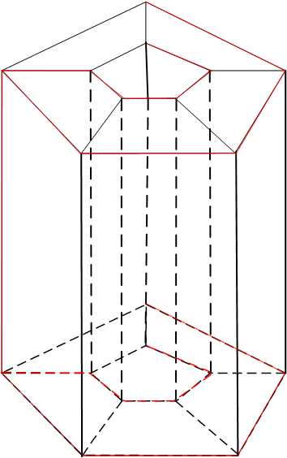

# Introduction

$$
\text{Beauty is the first test : there is no permanent place in the world for ugly mathematic——G.H.H\small{ARDY}}
$$

## Euler 定理

我们通过一个$\text{Euler}$的关于多面体的定理的证明开始.正如我们所示,这个命题以及对于定理的证明启发了很多关于拓扑学的想法.

$\text{Figure 1.1}$展示了四个多面体,它们每一个看起来都各有不同.

然而,若对于每一个多面体,我们将其顶点个数记为$(v)$,将其边的个数记为$(e)$,将其面的个数记为$(f)$,那么,$v-e+f$的大小都等于$2$.

公式
$$
v-e+f = 2
$$
是否对于所有的多面体都成立呢?

答案是否定的,但是对于一个庞大并且有趣的类中,结果是正确的.

我们通常都是以一些有规律的(或者是凸的)多面体(左侧三个多面体)来进行我们的第一步工作,而$v-e+f$对于这些多面体来说确实为$2$.然而,在我们的示例中有一个例子不是凸的,但是也满足上式并且不能去忽视这一点.

为了去寻找一个反例,我们需要变得稍微有一些些灵巧,考虑$\text{Figure 1.2}$和$\text{Figure 1.3}$所展示的多面体可以分别得到$v - e + f = 4$以及$v-e+f = 0$.

那么是哪里出问题了呢?

在第一种情况下我们构造了一个多面体,其表明由两个不同的部分组成,这似乎带上了一点欺骗性;用技术上的语言来说就是它的表面并不连通.我们怀疑(完全正确地)我们不应该允许这种情况发生,因为每一块表面对于$v-e + f$的贡献都是$2$.不幸的是,这个异议在$\text{Figure }1.3$中似乎不起效果,如图所示的多面体的表面是一个整体.然而这个表面在一个非常重要的方面与前面的不同.我们能在其表面上找到一个无法将多面体分成两个不同部分的回路($\text{loop}$);即,如果我们想象用一把剪刀围绕着这个回路剪开,多面体的表面展开后不会分成两个部分.在$\text{Figure 1.3}$中标出了一个这样的回路.

我们将表明对于不符合$\text{Figure 1.2}$和$\text{Figure 1.3}$所示性质的多面体都满足$v - e + f = 2$.

在进行下一步之前,我们需要明确的一点时直至目前为止,在我们的讨论中,只使用到了如图所示的一些固体的表面(除非我们提到凸性).所以,我们认为可以使用"多面体($\text{polyhedron}$)"一词来形容这样一个表面而不是其所包围的实体.

因此，多面体是平面多边形的有限集合,这些平面多边形在以下意义上很好地组合在一起:如果两个多边形相交,它们会相交在一条公共边上,而一个多边形的每条边恰好位于另一个多边形上.另外,如果我们考虑包含了特定顶点的一个多面体,我们便可以对其进行编号$Q_1,Q_2,\cdots,Q_k$,其中$Q_i$与$Q_{i+1}$有一个公共边($1 \leq i < k$).并且$Q_k$与$Q_1$有一个公共边.换句话讲,这些多边形结合在一起,在给定顶点的周围形成了一块表面($k$的大小因顶点而异).这最后一个条件排除了比如说两个立方体通过一个顶点连接而构成一个多面体的情况.

$(1.1)$$\text{Euler}$ 定理.令$P$是一个满足如下条件的多面体

1. $P$中的任意两个顶点可以被一条由边所组成的链所连接
2. $P$上任何由直线段(不一定是边)组成的回路可以将$P$分成两部分.

对于$P$成立$v - e + f = 2$

公式$v - e + f =2$有着悠久并且复杂的历史,它第一次出现在$1750$年$\text{Euler}$与$\text{Goldbach}$的书信中.然而,$\text{Euler}$对于他的多面体没有进行任何限制,这就导致他的推理只能运用于凸多面体的情况.$60$年后$(\text{Lhuilier})$才注意到如$\text{Figure 1.2}$和$\text{Figure 1.3}$中多面体所引出的问题.定理的精确描述和下面概述的证明都是由$\text{von Staudt}$在$1847$年发表的.

[证明]

$P$中连通的顶点和边所构成的集合称为图$(\text{graph})$:连通仅仅意味着任意两个顶点可以通过图中的边组成的链连接起来.更一般的,我们将使用图这个词来表示三维空间中任何有限连接的线段集合,它们像$\text{Figure 1.4}$一样很好的结合在一起(若两线段相交,则必然相较于一个公共顶点),一个不包含任何回路的图称为一个树$(\text{tree})$.不难发现,对于一个树,顶点的个数减去边的个数总是为$1$.使用$T$来表示一个树,那么可以得到$v(T) - e(T) =1$.

根据假设$1$.$P$中所有顶点和边的集合形成一个图.不难发现对于任意一个图都可以找到一个包含了$P$中所有顶点并且为树的子图.于是可以选择一个树$T$使其由一些便以及$P$中所有的点组成.($\text{Figure 1.4a}$展示了$\text{Figure 1.1}$中一个多面体的树).

接着形成一个树$T$的"对偶",这个对偶是根据如下方法所定义的一个图$\Gamma$:对于$P$中的每一个面$A$,我们给$\Gamma$一个顶点$\hat{A}$.$\Gamma$中的两个顶点$\hat{A}$和$\hat{B}$是被一条边连接的当且仅当$P$的对应面$A$与$B$相邻并且相交于$T$中的边.($\hat{A}$对应于$A$的一个内点).要做到这一点,我们不得不像$\text{Figure 1.5}$中的构造一般允许它的边是弯曲的.

不难发现这个对偶$\Gamma$是连通的因此其也形成一个图.直观地说,如果$\Gamma$的两个顶点不能被一条由边所组成的链相连接,则它们必然能被$T$中的一个回路所切割开来(其中所需要的证明我们在$\text{Chapter 7}$中会进行介绍).因为$T$为树(不会包含任何回路),于是我们得知$\Gamma$必然是连通的.

事实上$\Gamma$也是一个树.因为如果$\Gamma$中有一个回路,则根据假设$2$,它会把$P$分为两个不同的部分,而每个部分至少包含$T$的一个顶点.任何试图通过边所构成的链连接$T$中处于不同部分的两个顶点的尝试都会导致这个链满足这个分离回路,因此这条链无法完全位于$T$中.因此$\Gamma$是一个树.(对于如$\text{Figure 1.3}$所示的多面体,这个证明便失效了,因为其对偶图$\Gamma$包含一个回路)

> 
>
> 上图为$\text{Figure 1.3}$的一个树,接下来我们构建其对偶图$\Gamma$
>
> 
>
> 不难发现其存在一个回路.

因此对于任何树来说顶点的数量总是比边的数量多$1$.得到$v(T) - e(T) = 1$且$v(\Gamma) - e(\Gamma) = 1$于是
$$
v(T) - [e(T) + e(\Gamma)]+v(\Gamma) = 2
$$
根据树的构造得到$v(T) = v$,$e(T) + e(\Gamma) = e$并且$v(\Gamma) = f$.这就证明了$\text{Euler}$公式.$\Box$

## 拓扑等价

这里还有很多种关于$\text{Euler}$公式的证明.我们选择先前的证明是由于两个原因:其一,它很优美,其他很多证明都对于$P$的面数使用了数学归纳法.其二,因为它包含了比$\text{Euler}$公式更多的信息.再做进一步探讨,它实际上告诉我们$P$是由两个沿其边界的两个圆盘($\text{disc}$)所组成的.为了揭示这一点,仅仅需要将$P$上的$T$和$\Gamma$增厚一点(如$\text{Figure 1.6}$所示),就可以得到两个不相交的圆盘(对于树进行加厚总是可以得到一个圆盘(__灰色部分__),而对于带回路的图进行加厚可以得到一个带洞的空间).一点一点地扩大这些圆盘,直到它们的边界重合.多面体$P$现在就由两个具有相同边界的圆盘组成.虽然这些圆盘看起来形状相当古怪,但是我们可以将其展成一个圆形的扁平圆盘.

现在,将一个球由两个圆盘(南北半球)组成,并且沿着它们共同的边界缝合在赤道($\text{equator}$)上(如$\text{Figure 1.7}$)所示.换句话讲,$\text{Euler}$定理的假设旨在告诉我们$P$在某种意义上看起来像一个变形的球体.

当然,对于一个特定的多面体,在它的点和球体的点之间建立一个适当的对应关系是很容易的.举个例子,在正四面体$T$的情况下,我们可以通过$\hat{T}$处向$T$施加重力的径向投影(往外)将$T$投影到一个以$\hat{T}$为球心的球体上(__以后称其为径向投影法__).$T$中的面投射到球体上的曲线三角形上(如$\text{Figure 1.8}$所示).事实上$\text{Legendre}$正是使用了这个过程证明了凸多面体的$\text{Euler}$定理.我们稍后将描述其证明过程.

在$\text{Figure 1.1}$右侧所展示的多面体并不是凸的也不适合上述论证.然而,如果我们认为它是由橡皮制成的,那么我们很容易想象如何将其变形为一个普通的球体.在变形的过程中,我们可以随意拉伸和弯曲多面体,但是不能生成新的顶点也不会撕裂多面体.

给定多面体上的点与球面上的点的对应关系是拓扑等价或同胚的一个例子.在正式场合中它是一个一一的具有连续逆的连续函数.(__此即拓扑等价的定义__)

我们将在$1.4$节中自习研究同胚的定义,在此,为了能够具体地了解同胚,我们现在给出了四个例子($\text{Figure 1.9}$)

$(a)$ 圆柱体的表面,不包括其上两个圆

$(b)$由方程$x^2 + y^2 - z^2 = 1$给出的单叶双曲面($\text{one-sheeted hyperboloid}$)

$(c)$$1<|z|<3$所给出的复平面上的开环(指两边是开的)

$(d)$去掉南北极点的球体.

我们将给出一个$(b)$到$(c)$的具有具体同胚(连续的,一一的,并且具有连续逆的函数).

表示$(b)$中点最方便的方式就是使用柱坐标表示$(r,\theta,z)$,对于$(c)$则是使用平面极坐标$(r,\theta)$来表示.

当$(b)$中$\theta = 0$我们便得到了双曲线$x^2 - z^2 = 1$的一支,我们打算将其放在相应的环面上($(c)$中的环面)即射线$\{(x,y):1<x<3,y = 0\}$(注意,这是极坐标).如果我们能够对于所有的介于$0$到$2\pi$中的$\theta$都连续的执行先前的操作,那么我们将会得到前文所需要的同胚映射.定义函数$f : (-\infty,+\infty) \to (1,3)$且$f(x) = \frac{x}{1+|x|}+2$.不难发现$f$是一个双射,并且$f$是连续的且有连续逆.于是我们便可以把$(r,\theta,z)$中的点映射到$(f(z),\theta)$.

接下来,我们将引领读者去研究其他的可能性:注意到拓扑等价关系显然是一个等价关系

> 由于$a$与$b$拓扑等价是指$a$与$b$间存在一个一一的具有连续逆的连续函数,于是存在$f : a \to b$使得$f$是一个一一的具有连续逆的连续函数,于是由于$f$是双射,可以考虑其逆$f^{-1}$,由于$f$具有连续逆,于是$f^{-1}$也是连续的,并且不难得出$(f^{-1})^{-1} = f$而$f$也是连续的.于是可以说$f^{-1}$具有连续逆.
>
> $f^{-1}: b \to a$也是一个一一的,具有连续逆的连续函数,于是得知$b$与$a$也拓扑等价(对称性)
>
> 接下来验证另外两个性质.
>
> 自反性:
>
> 考虑恒等变换$\text{id}_a$将$a$中的每个元素$x$映射到其自身,其显然会是一个连续函数,并且其对于自身就构成一个逆,也就是说其满足拓扑等价的条件.即$a$对于自身拓扑等价.
>
> 传递性:
>
> 若$a$与$b$拓扑等价,$b$与$c$拓扑等价,那么存在$f : a \to b$,$g: b \to c$使得$f$和$g$均为一一的具有连续逆的连续函数.由于$f$和$g$均为双射,于是$g \circ f: a \to c$也是双射,并且由于其同时为连续函数,由于是$g \circ f$也为一个连续函数.不难发现$(g\circ f)^{-1} = f^{-1}\circ g^{-1}$也为一个连续函数,即$g \circ f$具有连续逆.于是$a$与$c$范畴等价.
>
> 综上所述,范畴等价确实为一个等价关系.

因此,若我们能够证明空间$(a)$和$(d)$与空间$(c)$拓扑等价,就可以验证$4$个空间相互拓扑等价(使用传递性和对称性).在拓扑学中,我们认为这$4$个空间是"相同的空间".去掉三个点的球面与前面几个空间则是不同的(不同胚)这是为什么呢?是否能够描述复平面的一个子集同胚于移去三个点的球面?

回到$\text{Euler}$定理的证明,将树$T$和$\Gamma$进行增厚后将$P$分解为一个具有两个共同边界的圆盘,因此,可以同构将一个圆盘中的点映射到北半球,另一个圆盘中的点映射到南半球,这是一种定义多面体$P$到球的同胚的方法.制造一个反例是有可能的(我们将在$\text{Chapter 7}$中进行详细讨论)并且证明如果$P$拓扑等价于一个球面,那么$P$满足$(1.1)$的两个条件(其中条件$1$是很容易进行验证的,由于$P$拓扑等价于一个球,于是其边可以拓扑等价于球上的边,由于我们可以将其视为是相同的空间,于是$P$上任意两个顶点之间是否能够由边构成的链连通便转化成球上任意两点是否能够由球上的边构成的链所连接,这是显然的;而条件$2$的证明比较难,这是著名的$\text{Jordan}$曲线定理的一个特例),于是$\text{Euler}$定理可以作用于$P$.从而,若$P$与$Q$为拓扑等价于球的多面体,并且若我们称$v-e+f$作为多面体的$\text{Euler}$数,则我们从前面的讨论中可以得知$P$与$Q$具有相同的$\text{Euler}$常数$2$.

在$\text{Figure 1.3}$中展现的多面体具有完全不同的形式,它同胚于一个环面(我们甚至可以想象如何将其连续变成一个环面,如$\text{Figure 1.10}(b)$所示,)并且其$\text{Euler}$数为$0$.对于任何其他的与环面同胚的多面体并且去计算其$\text{Euler}$数会发现均为$0$.(尽管这很难证明,直到$\text{Chapter 9}$我们才将其证明).我们现在仅仅需要一个小步骤(一个小步骤是在数学直觉上的小步骤,但是详细证明我们还有很长的路要走)就可以触及拓扑最基本和最核心的结果之一了.

$(1.2)$定理:拓扑等价的多面体具有相同的$\text{Euler}$数.

这个显著的结果是现代拓扑学的起点.值得注意的是,在计算多面体的$\text{Euler}$数时,我们使用了多面体的顶点,边和面的数量,它们经过拓扑等价都不一致(即拓扑等价不会保证它们相等).它导致对空间其他性质的探索,这些性质在同胚中的应用没有改变.

我们稍后应当回到$\text{Euler}$数,并且表明其可以在比目前所考虑的普通多面体更广泛的空间中被定义.这些多面体更加"坚硬",有角,边,有平面,我们不会特别感兴趣.在拓扑学家的角度上球体足以表示$\text{Figure 1.1}$所展示的所有多面体.

我们的准则如下:$\text{Euler}$数$2$不属于某一类特定的多面体,_它属于球面_.一个满足$\text{Euler}$定理假设的多面体(同胚于球面的一个多面体)仅仅给出一种计算球的$\text{Euler}$数的方便方法.有了这个重点,定理$(1.2)$表明,用明显不同的方法计算总是得到相同的答案.我们将在$\text{Section } 9$继续进行讨论.

我们以$\text{Legendre}$对于凸多面体上$\text{Euler}$公式的独特证明来结束本节,如$\text{Figure 1.8}$所示,使用径向投影法将多面体投影到半径为$1$的球面上,多面体的多边形边投影为球面上的多边形.

现在,若$Q$是一个具有角$\alpha_1,\alpha_2,\cdots,\alpha_k$并且带有$n$条边的球面多边形,那么$Q$的面积由
$$
\alpha_1+\alpha_2+\cdots+\alpha_k - (n-2)\pi = (\alpha_1+\alpha_2+\cdots+\alpha_k)-n\pi + 2\pi
$$
 不难发现球上的所有球面多边形的面积之和为$2\pi v - 2\pi e + 2\pi f$(每个顶点的总角度为$2n$,因此$2nv$正好包含了所有的$\alpha_i$($i = 1,2,\cdots,k$),每条边都要被计数两次,因为其正好属于两个多边形面,每个面在上式中贡献一个$2\pi$).由于单位球的表面积为$4\pi$于是得到$2\pi v - 2\pi e + 2\pi f = 4\pi \Leftrightarrow v - e + f =2$.

## 曲面(Surfaces)

### 十万个为什么阶段(吐槽)

拓扑学与空间有关的性质不会被拓扑等价或者同胚所改变.但是什么类型的空间对我们有吸引力以及我们平常所说的"空间"到底是什么意思?同胚的概念与连续性的概念密切相关;两个空间之间的连续函数是什么意思?我们将在这一节和下一节中讨论这些问题.

### 正文

我们先从一些有趣的空间起步,从事分析工作的人总是习惯于考虑一个实线,一个复平面甚至在一个单位闭区间上的所有实值连续函数所构成的集合称为(度量)空间.作为本质上是几何学家的我们对于欧式空间中自然出现的有界构型更感兴趣.

举个例子,例如在平面上的单位元和单位圆盘,球面,环面,$\text{M}\ddot{\text{o}}\text{bius}$环带,圆柱面和带穿孔的双环面等表面都存在于三维空间中,如$\text{Figure 1.10}$所示.

此外还有性质更为复杂,更加难以想象的像$\text{Klein}$瓶这样的表面,其难以想象源于任何试图在三维空间中表示它时,$\text{Klein}$瓶都必须与自己交叉.在图中$(\text{Figure 1.10})$,这个曲面被切割成一个小圆.我们可以通过建立$\text{Klein}$瓶的模型来更好地理解它.

考虑我们通常用来构建环面的方法:从$\text{Figure 1.11}$所示的长方形纸开始(此处为构造圆环),确定边缘.前半部分与圆环的构造是一致的,但是到了圆柱体这个阶段,其两端需要向着相反的方向确定(具体如$\text{Figure 1.12}$所示)为了做到这一点,就必须让圆柱体弯曲,一段穿过其侧面.

在四维空间中$\text{Klein}$瓶$(K)$可以不带任何自交地被构造出来.

> 不妨想象一个独立于纸面的额外维(注意,我们认为纸面是一个三维空间).在$K$的交叉点处附近有$2$根管子,其中一根穿过另一根管子,将右上方那根管子提到纸张之外,然后在四维空间中表示出的另一个管子的部分在四维空间中的"坐标"只是局限的(比如说在三维空间中表示一个圆可以只用两个坐标$x$和$y$进行表示,而$z$可以始终维持在某个常数上,那么我们想连通圆内和圆外的两点$a$和$b$,在二维的平面上来看是不可能的,但是我们在三维情况下看则可以发现由于圆的$z$轴大小均为固定的,于是可以通过$z$轴构造一道"桥"连接$a$与$b$但是又不与圆相交).于是我们可以通过第四个维度构造一个"桥"绕过另一根管子的壁而进入其内部(我们使用四维空间对其进行坐标表示可以发现其第四个维度可以保持在某个区间大小之内,也有可能是一个常数,于是我们可以在四维空间中构造一个"桥"),于是在四维空间中,纸中的"壁"可以在第四个维度中绕过,即从纸张之外将管子"接进去"是不会与三维空间中的部分相交的.

上文看起来比较难想象,可以通过$\text{Figure 1.13}$来辅助理解

上图中$(a)$不分两条直线是相交的,$(b)$部分将一条直线提到三维空间再放下(也就是跳线)后,它们本质上是没有相交的.从四维空间中看待$\text{Klein}$瓶的方式也类似于这样.

我们通过欧式空间中表示曲面来引入曲面的方法也不像想象中那么好.我们更感兴趣的是"通过同胚改变"的曲面,换句话说,拓扑等价的曲面将会被视为相同的空间.

在$\text{Figure 1.14}$中我们给出了$3$份$\text{M}\ddot{\text{o}}\text{bius}$环带$(M)$.前两个是同胚的,这并不奇怪,我们只需要将第一个像拉橡皮一样拉伸成为第二个(认为空间是由橡皮构成来解释拓扑等效的想法源于$\text{M}\ddot{\text{o}}\text{bius}$,可以追溯到$1860$年左右).但是$1.14(a)$和$1.14(c)$之间是否同胚呢?这两个空间是同胚的,但是无论怎样拉伸,弯曲都无法将其中一个空间变为另一个.

于是为了证明两个空间是同胚的,必须在它们之间找到一个连续的双射,并且保证其逆也是连续的.现在忘记我们先前所构建的$\text{M}\ddot{\text{o}}\text{bius}$环带,现在试着自己构造一个$M$.建立一个模型是简单的:从一个长方形纸张开始,找到一对对边$(A)$和$(B)$,将其中一边扭曲半圈($180$度),而后将其拼到一起便得到了先前的$\text{Figure 1.14a}$.

为了得到$\text{Figure 1.14c}$,我们必须在原来的步骤上(扭转$180$度后)再扭转一个整圈($360$度)而后将其拼接起来,即对于一个长方形纸片的一边转一圈半后再拼到其对边上.

但是上述两步对于边$A$与边$B$的方向却没有改变(还是通向的),也就是说在$1.14\text{a}$中相交的点(相对于相交位置的坐标)在$\text{1.14c}$中保持一致.于是$\text{1.14a}$和$\text{1.14c}$所展示的空间是同胚的.它们只是同一个空间在欧式空间中的不同表示.

尽管我们可以找到它们之间的同胚,但是没有办法将这种同胚拓展到整个欧式空间上,即不存在欧式空间到自身的同胚映射将$1.14 \text{a}$投影到$1.14\text{c}$上.

由于我们的直觉在$\text{Figure 1.14}$这种图片上产生歧义,这表明我们需要一种抽象化空间,而不是依赖于它们在欧式空间中特定的代表形状.接下来我们会尝试把曲面的概念转化为精确的数学语言.这个过程会相当漫长,首先其涉及到抽象(拓扑)空间的定义,其次去认识曲面是那些局部看起来像欧式空间的空间.

## 抽象空间

为了找寻一个令人满意的拓扑空间定义(现代定义出现的很晚,拓扑空间的公理是在$1914$年首次出现在$\text{Hausdorff}$的著作中)我们心中应当追寻两个目标:

* 定义应当足够通用,以允许足够广泛的结构(指足够多的结构都适用)作为空间.我们打算考虑一个有限的,离散的点所构成的集合作为空间,或者同样地考虑一个完整的不可数点的连续体,比如实线作为空间.一个漂亮的集合曲面应当符合这个定义,一个函数空间(比如复平面单位元上定义的连续复值函数集合)也应当符合这个定义.我们希望对于我们的空间进行简单的构造(例如取两个空间的笛卡尔积)或者确定空间中的一些点以形成一个新的空间(比如前文中$\text{M}\ddot{\text{o}}\text{bius}$环带的构造)
* 空间的定义应当包含足够多的信息,以便我们定义空间之间的函数的连续性的概念.(正是这一点引出了我们下文所将的抽象定义).

令$f$为两个欧式空间之间的函数,记为$f:  \mathbb{E}^m \to \mathbb{E}^n$.关于$f$的连续性的经典定义如下:若对于任意的$\varepsilon>0$,存在$\delta>0$当$\|\boldsymbol{y} - \boldsymbol{x}\|<\delta$时有$\|f(\boldsymbol{y}) - f(\boldsymbol{x})\|<\varepsilon$则称$f$在$\boldsymbol{x} \in \mathbb{E}^m$上连续.若其对于所有的$\boldsymbol{x} \in \mathbb{E}^m$都满足上述条件则称$f$为一个连续函数.如果对于某个实数$r > 0$的以$\boldsymbol{p} \in \mathbb{E}^m$为中心,$r$为半径所组成的实球完全处于$N$内($N\subset \mathbb{E}^m$,注意,$N$不是实球,它只是一个子集)则称$N$为点$\boldsymbol{p}$的邻域.可以容易的将连续性的定义改写为:若对于任意的$\boldsymbol{x}\in \mathbb{E}^m$以及任意$f(\boldsymbol{x})$在$\mathbb{E}^n$中的邻域$N$都有$f^{-1}(N)$是$\boldsymbol{x}$在$\mathbb{E}^m$上的邻域.

空间中的每个点都有一组"邻域",这些邻域反过来又能很好地定义连续函数,所以这一概念是至关重要的.注意到在定义欧式空间中的邻域时,我们使用了点与点之间的欧式距离,于是在构建抽象空间时,我们希望保留邻域这个概念但摆脱对于距离函数的依赖(拓扑等价是不保持距离的,可以通过$\text{Figure 1.8}$四面体上两点之间的距离与其投影到球面上后两点之间的距离看出).

通过对于欧式空间中点的邻域的性质的考察,我们可以得到拓扑空间的下列公理.

> 这些公理的得出需要在欧式空间中的邻域概念里去掉距离有关的内容,即我们只通过集合之间的关系来定义这个公理.
>
> 那么不难发现邻域对于集合的运算满足集合的交并仍为邻域
>
> 对于每个元素$x$的邻域必然有其自身也包括在邻域中
>
> 邻域与任意集合的并集也是一个邻域(其至少包含原来那个邻域所满足的实球)
>
> 若该邻域还作为其他元素$z$的邻域,则考虑$\mathring{N} = \{z\in N : N\text{是}z\text{的邻域}\}$(其实就是$N$的开核)有$\mathring{N}$为$x$的邻域

$(1.3)$ 对于集合$X$,若对于$X$中的每个点$x$都有一组非空的$X$的子集,将其称为$x$的邻域.这些邻域需要满足以下四条公理.

1. $x$需要在其邻域内
2. 两个邻域的交集还是一个邻域
3. 如果$N$是$x$的一个邻域,并且$U$是$X$的一个包含了$N$的子集,则$U$也是$x$的一个邻域
4. 若该邻域还作为其他元素$z$的邻域,则考虑$\mathring{N} = \{z\in N : N\text{是}z\text{的邻域}\}$(其实就是$N$的开核)有$\mathring{N}$为$x$的邻域

这整个结构称为拓扑空间,对于每个$x \in X$满足公理$1-4$的邻域集合称为$X$上的拓扑(为了给公理$4$增加一点点的动机,在$\mathbb{E}^m$中取点$\boldsymbol{x}$令$B$(一个开球)表示与$\boldsymbol{x}$的距离小于$1$的点所构成的集合(一个实球减去其边界部分),于是$B$是一个$\boldsymbol{x}$的邻域)

现在,我们可以精确地说明连续函数和同胚到底是什么意思了.

令$X$和$Y$是拓扑空间(根据定义$(1.3)$生成的复杂结构).

* 一个函数$f : X \to Y$是连续的若对于每个$x \in X$以及所有的$f(x)$在$Y$中的邻域$N$都有集合$f^{-1}(N)$是$X$中关于$x$的邻域.

* 一个函数$h : X \to Y$被称为是同胚映射若其为一个一一的,连续的且具有连续逆的函数,如果这样一个函数存在,那么$X$和$Y$之间可以称为同胚(或拓扑等价)空间.

突然之间,事情变得非常复杂,接下来我们需要一些例子来辅助我们理解这些概念.

$Example$

1. 任何具有邻域定义的欧式空间都是拓扑空间(稍后我们将证明不同维数的欧式空间不可能同胚,这是一个很难的问题.但是如果我们有足够的信心让我们的同胚定义和空间的维度概念共存,这是必不可少的)

2. 设$X$是一个拓扑空间,$Y$是$X$的一个子集,我们可以通过如下方式来定义$Y$上的拓扑:对点$y \in Y$取其在$X$中的一组邻域集合再对每个邻域与$Y$求交集,这样就得到了$y$在$Y$中的一组邻域其关于拓扑空间的公理是很容易验证的,我们称$Y$有一个子空间拓扑.这是一个非常有用的步骤,比如它允许我们把欧式空间中的任何子集视为一个拓扑空间.特别地,我们的曲面例子也就称为了一个拓扑空间.

3. 用$C$表示复平面上的一个单位圆且用$[0,1)$表示大于等于$0$且小于$1$的实数.我们分别从平面和实线给出这两个集合的子空间拓扑.定义一个函数$f : [0,1) \to C$使得$f(x) = e^{2\pi i x} = \cos(2\pi x)+i\sin(2\pi x)$,显然有这是一个连续函数,并且这是双射,但是它的逆却是不连续的(考虑其逆$f^{-1}(x) = \frac{\ln(x)}{2\pi i}$,考虑$f(0) = e^{0} = 1$在$C$上的邻域$f^{-1}(N)$有其逆包含$0$且一部分接近$0$一部分接近$1$,但是由于$0$作为边界点,不为内点,$\mathring{f^{-1}(N)}$并不包含$0$,所以可以得知$f^{-1}(N)$不为$0$的邻域).这很好地说明了反函数连续这个条件在同胚定义中的重要性:我们不乐意看到圆与区间同胚.

4. 以$\text{Figure 1.8}$所示的情况为例,将球体与四面体视为$\mathbb{E}^3$的一个子空间.考察径向投影$\pi$在这两个空间中给出的一个同胚,这类同胚称为三角剖分(这是在球面上的情况)并且这将会是我们后继章节的主题.

5. 集合上的距离函数或者度量会产生集合上的拓扑邻域的构造完全类似于欧式空间中的过程.我们举例说明函数空间的情况,设$X$是所有定义在闭区间$I$上的连续实值函数所构成的集合.集合中的函数必然是有界的(连续并且在闭区间上,于是没有间断点),通常把$X$上的距离函数定义为
   $$
   \text{d}(f,g) = \sup_{x\in I}|f(x) - g(x)|
   $$
   给定一个函数$f \in X$,若存在一个正实数$\varepsilon$,所有与$f$距离小于等于$\varepsilon$的$g \in X$都属于$N$,则称$N$为$f$的一个邻域.

6. 两个不同的拓扑空间可能会基于一个相同的点集.作为实数集合上一个相当奇特的拓扑的例子:定义一个实数的子集如果它包含该实数并且其补集是有限的则称其为一个特殊的实数邻域.这就给出了一个与实线不同的(不同胚)的拓扑空间.注意在实数集合上没有距离函数可以产生这种拓扑(由于其补集有限,即至多只存在可列个点不被其所包含,若存在距离函数$d$使其可以产生这种拓扑,则令$x,y \in X$,取$D = d(x,y)$于是得到以$x$为球心,以$D$为半径的实球$D_x$正好经过$y$,同理$D_y$正好经过$x$,接下来,设$B'_x$是以$\frac{D}{2}$为半径所构成的__开球__,同理得到$B'_y$于是有$B'_x \cap B'_y = \varnothing$而$B'_x$和$B'_y$,显然有$B'_x$和$B'_y$非空,且其可以定义前文的邻域,由于补集有限,于是对于$x$考虑有$(B'_x)^c$包含有限个点,即$B'_x$包含无穷多个点,接着对于$y$进行讨论得到$(B'_y)^c$具有有限个点,而$B'_x \subset (B'_y)^c$,于是其只有有限个点,与前文的推论矛盾.)

7. 设$X$是一个集合,并且对于所有的$x \in X$,定义$\{x\}$作为$x$的邻域,于是根据公理$3$,$X$中任何包含$x$的子集均为$X$的邻域.直观地,我们认为这种拓扑结构式把$X$变成一个离散的点的集合,我们安排每个点$x$都有一个不包含其他点的邻域,那么在这种拓扑下,任何具有定义域的函数$X$都是连续的.

现在,我们已然开发出了一款足够完备的工具,这可以准确地表示我们所说的曲面是什么,并且摆脱了必须在欧式空间中的束缚.

$(1.4)$ __定义__:曲面是一个拓扑空间,其中每个点都有一个邻域同胚于一个平面,并且任意两个不同的点都有不相交的邻域.

花费点功夫详细研究这个定义肯定是物有所值的.空间中每一个点都有一个与平面同胚的邻域这一要求正好符合我们对于曲面的直观理解.如果我们站在某一个点上(想象一个巨大的表面,地球就是一个例子除非你认为地球是平的,看着离我们脚很近的点,我们应当能够想象我们站在一个平面上.仔细想想这个要求:我们要求空间中每一个点的某个邻域与平面同胚.那么,我们必须把这个邻域当作自身的一个拓扑空间来看,这并没有什么困难(邻域毕竟是给定空间的一个子集),因此我们可以为它建立一个子空间拓扑.

第二个要求,即任何两个不同的点都有不相交的邻域,这在本质上更有技术含量.它是由我们日常经验所引出的:我们所有曲面的例子都具备这个性质,但是局部看起来像平面的空间无法直接满足这个性质.

我们给了一个尽可能简单的定义.如果我们希望允许一个曲面具有边缘或者边界(如$\text{M}\ddot{\text{o}}\text{bius}$环带的情况),那么我们就不能指望每一个点都与平面有邻域同胚.我们必须允许有邻域同胚于上半平面($y \geq 0$的部分).当它们从欧式空间中得到子空间拓扑时,所有曲面的例子现在都很好地符合这个定义.$\text{Figure 1.16}$说明了$\text{M}\ddot{\text{o}}\text{bius}$环带情况下的定义.

## 一个分类定理

在$1.3$节开始前,我们曾声称自己是几何学家,但在这里,我们慢慢地陷入了技术细节的泥沼.为了逃避这些细节泥潭(暂时的逃避,将在下一章对于抽象拓扑空间的性质进行更详细地研究)我们将回到曲面理论.

我们应该限制在一个相当好的曲面类型中,并且只考虑那些没有边界的以及在某种意义下是封闭的曲面:此外,我们还要求我们的曲面是连通的,即由单个部分组成的.球体,环面以及$\text{Klein}$瓶都是我们想象出的符合要求的表面,而圆柱体和$\text{M}\ddot{\text{o}}\text{bius}$环带由于具有边而被排除在外.接着排除平面以及$\text{Figure 1.9}$所示的曲面,由于其不"闭合"$(\text{closed})$.

确切地说,我们处理的是紧致的,连通的曲面,但是紧致性和连通性的精确定义要等到$\text{Chapter 3}$才会给出.

值得注意的是,如果我们只同意在这些所谓的"闭合"曲面上进行工作,那么我们或许可以得知它们具体的数量,并且对它们进行归类.这样的分类需要制作一个曲面的列表,使得给定任意一个闭合的曲面都同胚于列表中的某一个曲面,另一方面,列表又不能太长,也就是说,我们的列表中不存在两个同胚的曲面.

我们可以构建如下的闭合的曲面作为示例.对于一个正常的球面,取下两个不相交的圆盘,然后添加一个圆柱体将其两个边界圆与球体的两个边界口相连,得到如$\text{Figure 1.17}$所示的曲面.这个过程称作给球面"加个柄".经过重复,我们可以得到一个带有两个,三个或任意有限个的柄的球体.

不难看出一个只有一个柄的球体同胚于环面(可以将环面的一部分进行橡皮扩张称一个球).这个添加把柄的过程提供了列表中一半的表面.

其他一些封闭曲面与克莱因瓶类似,它们无法在欧几里得三维空间中表示,并且因此更难以想象.幸运的是,构造这些曲面的模型是一个容易描述的过程.从一个球体开始,去掉一个圆盘,并在它的位置上加上一个莫比乌斯带.莫比乌斯带的边界实际上只有一个圆,我们要求的是将这个边界圆的点与球体孔的边界圆的点进行等同.我们必须想象这种等同发生在某个有足够空间的地方(例如欧几里得四维空间,在$\text{Chapter 4}$中我们将会解释如何将两个拓扑空间粘合在一起以形成一个新的空间,从而不以任何方式依赖于$\mathbb{E}^3$和$\mathbb{E}^4$中的空间模型),如前面所提到的,在三维空间中是无法实现的,因为会导致莫比乌斯带与自身相交.由此构造得到的封闭曲面被称为射影平面.

对于每一个正整数$n$,我们都可以通过从球面中拆除$n$个不相交的圆盘并且将其换为$\text{M}\ddot{\text{o}}\text{bius}$环带来得到一个封闭的曲面,当$n = 2$时,我们重新捕捉到$\text{Klein}$瓶.$\text{Figure 1.18}$是一个对其进行解释的尝试.在平面上把$\text{Klein}$瓶切成两半,并且移除两部分的自交点,这样就可以得到$\text{Figure 1.18}(a)$中的两个$\text{M}\ddot{\text{o}}\text{bius}$环带(注:左侧为沿着自交点向外剪的$\text{M}\ddot{\text{o}}\text{bius}$环带,右侧为向内剪去的情况)

取其中一个并且在其边界的一带上进行标记($\text{Figure 1.18}(b)$);不难发现这个带状区域同胚于一个圆柱体,接着我们移除这样一个圆柱体($\text{Figure 1.18}(c)$),留下一个较小的$\text{M}\ddot{\text{o}}\text{bius}$环带.并且由于圆柱体同胚于一个球体去掉两个不相交圆盘的形状(于是$\text{Klein}$瓶相当于一个圆柱体加上两个$\text{M}\ddot{\text{o}}\text{bius}$环带亦即球面拆除两个圆盘并换成$\text{M}\ddot{\text{o}}\text{bius}$环带).因此,当$n = 2$时,$\text{Klein}$瓶的通常描述与我们的构造一致.

$(1.5)$ 分类定理 : 任意封闭曲面要么同胚于一个球,或一个球加上有限个柄,亦或者一个球拆除$n$个不相交的圆盘并将圆盘转化为$\text{M}\ddot{\text{o}}\text{bius}$环带.并且上述曲面两两不同胚.

举个例子,取一个带有一个把柄的球面,接着移除一个圆盘,将移除的部分改为$\text{M}\ddot{\text{o}}\text{bius}$环带,这样就得到了一个域去掉三个不相交圆盘并且用$\text{M}\ddot{\text{o}}\text{bius}$环带代替的球体同胚.我们将在$\text{Chapter 7}$中对其进行证明.

在球体上添加$n$个柄后形成的曲面称为亏格为$n$的可定向曲面.我们之所以称之为可定向曲面是因为以下原因:如果我们在其上绘制一条平滑闭曲线,在某一点选择其切向量与法向量(即在该点选择一个坐标系,通常称为局部定向),而后将这些向量沿着曲线推进一周,会回到相同的坐标系上(即切向量与法向量方向保持不变)如$\text{Figure 1.19}(a)$所示.包含$\text{M}\ddot{\text{o}}\text{bius}$环带的任何曲面,也就是列表中的后面那类,都无法满足这个性质,因此被称为不可定向曲面.$\text{Figure 1.19}(b)$显示了当我们将切向量和法向量沿$\text{M}\ddot{\text{o}}\text{bius}$环带的中心推进一周之后发现——法向量会反向(注意看$5$和$1$)

曲面的分类是由$\text{M}\ddot{\text{o}}\text{bius}$$(1790-1860$)在一篇提交给巴黎科学院的参与获奖的数学论文中首次提出并继续深入探讨了可定向情况下的曲面分类问题,当时他已经是$71$岁高龄.但是评委会认为收到的所有稿件都不值得获奖,因此$\text{M}\ddot{\text{o}}\text{bius}$的工作最终只是作为另一篇数学论文发表出来.

## 拓扑不变量

我们应该能够马上发现我们不可能对于所有的拓扑空间进行分类.然而,我们想开发一种方法来确定两个具体的空间,比如两个曲面之间是否同胚.

不难发现证明两个空间的同胚关系是一个几何问题,涉及到它们之间构造一个特定的同胚.此处所用到的方法因问题而异.我们已然给出了一个例子(至少在轮廓上)表明$\text{Klein}$瓶同胚于一个球面移除两个不相交的圆盘并将其转化为$\text{M}\ddot{\text{o}}\text{bius}$环带后的曲面.

试图证明两个空间彼此不同胚是一个性质完全不一样的问题,我们不可能在两个空间之间检查它们之间所有的函数来得到它们不同胚.相反,我们通过寻找空间中的一个"拓扑不变量":这是一个可能代表了空间的几何属性的不变量(类似于$\text{Euler}$数),被空间或者代数系统所定义(例如由空间所构造的群和环)重要的是,同胚可以保留不变量——因此得名.如果我们怀疑两个空间不同胚,我们可以通过计算一些合适的不变量并且表明它们有所不同来证实我们的怀疑.下面举两个例子.

在$\text{Chapter 3}$中我们将介绍连通性的概念:简单粗暴的说,如果空间是一体的,那么空间就是连通的.这个概念可以非常精确,如果我们将一个同胚应用到空间上,我们将发现其连通的性质是保留的,即连通是一个拓扑不变量.平面$\mathbb{E}^2$就是一个连通空间的例子.假设现在我们有一个同胚$h : \mathbb{E}^1 \to \mathbb{E}^2$.它将诱导一个同胚从$\mathbb{E}^1\setminus \{0\}$到$\mathbb{E}^2\setminus\{h(0)\}$.但是$\mathbb{E}^2$去掉一个点是一个连通空间(它是一体的)然而$\mathbb{E}^1 \setminus \{0\}$不是连通的.于是我们得知$\mathbb{E}^1$和$\mathbb{E}^2$不同胚.

第二个例子,我们将考虑一个源于$\text{Poincar}\acute{\text{e}}$的结构(这是$\text{Chapter 5}$的主题)其思想是给每一个拓扑空间都分配一个群,使得同构空间的群互相同构,那么若我们想要区分两个空间,就可以使用代数的方法来解决这个问题,首先计算它们的群,然后观察这些群是否同构,若群不同构,则两个拓扑空间彼此不同胚.当然,我们可能会不幸的得到同构群(这个时候还不能认为两个拓扑空间同胚)就需要额外找其他的拓扑不变量来区分这两个空间.

考虑$\text{Figure 1.20}$中所展示的两个空间,我们不期望它们是同胚的,毕竟环($\text{annulus}$右侧)上有个洞而圆盘(左侧)上没有.

这个洞可以很好地用回路$\alpha$来表示如$\text{Figure 1.21}$所示.正是这个洞阻止了我们不断地收缩,在不离开环的情况下收缩到一点,而在圆盘中,任意回路都可以连续的收缩到一点.$\text{Poincar}\acute{\text{e}}$的结构利用像$\alpha$一样的回路构建一个群(称为这个环的基本群),这个群包含环有一个洞的事实.

像$\alpha$这样的回路会造成一个带有非平凡元素的基本群.重新观察环面,从对于洞的识别的角度上看,回路$\beta$和回路$\alpha$是一致的,因为它可以在不穿过洞的前提下连续地转化为回路$\alpha$.这就表明回路$\beta$与回路$\alpha$在基本群中应当代表同样(类型)的元素.

从特定点开始和结束的一个回路应当意味着有一种自然的将这些回路相乘的方式.我们将两个回路的乘积$\alpha \cdot \beta$定义为一个先穿过$\alpha$然后穿过$\beta$的回路.在这种乘法下,回路本身并不构成一个群,但是若我们意识到一个回路可以连续地变为另一个回路(不需要移动它们的终点),那么我们就可以从这些回路的等价类(即顺逆时针绕过洞的次数是一个等价关系)中得到一个群.

> 我们将沿着顺时针绕过一次洞的回路$\beta$记为$-1$,将沿逆时针绕过一次洞的回路$\alpha$记为$1$,将回路$\alpha \cdot \beta$记为$0$,那么我们可以发现上述乘法类似整数的加法.
>
> 那么不难发现这个乘法满足封闭性(对于任意的回路$a$和$b$均满足$a \cdot b$为一个绕过洞可列次的回路)
>
> 结合律:$(a\cdot b)\cdot c$表示先经过$a\cdot b$再经过$c$的回路,即先经过$a$,再经过$b$最后经过$c$的回路,$a\cdot(b\cdot c)$表示经过$a$后经过$b\cdot c$的回路,将$b\cdot c$转义为先经过$b$再经过$c$的回路即可.于是发现$(a\cdot b) \cdot c = a \cdot(b\cdot c)$
>
> 于是可以得知基本群是一个半群.
>
> 由于前文中将$\alpha \cdot \beta$回路记为$0$,这也表示这是一个朝顺时针绕洞和逆时针绕洞次数相同或不绕过洞的回路.对于任何回路$a$都有$a\cdot 0 = a$即其逆时针绕洞次数为$a$次.于是基本群是一个含幺半群.
>
> 对于任意的$a$都存在回路$-a$使得其$a\cdot( -a )= 0$(将$-a$拆解为若干个$\beta$的乘积即可),于是基本群是一个群.
>
> 不难发现,环上的基本群同构于整数加法群.

以上的讨论是相当精确的,从数学上来讲,拓扑空间$X$中的一个回路不过是一个连续函数$\alpha : C \to X$,其中$C$表示复平面上的一个单位圆,并且若$\alpha(1) = p$则称回路的起点和终点都在$X$中的点$p$上.将$C$参数化为$\{e^{i\theta}: 0 \leq \theta \leq 2\pi\}$在我们的图中,回路上的箭头表示增加$\theta$的方向.翻转箭头就可以产生一个不同的回路,并且这是在基本群中原回路相应元素的逆.回路大概是一个将$C$中的所有元素都送到$p$点的函数,这代表着这个基本群的单位元.

圆盘上的基本群则是一个平凡群,因为其上的任意回路都可以连续地缩小到一点上(我们将在$\text{Chapter 5}$对于连续变形进行定义).对于圆环,我们得到了一个整数的无限循环群.在$\text{Figure 1.22}$中分别展示了代表$0,-1$和$2$的回路.

不难想象,同胚的空间具有同构的基本群.毕竟,若$\alpha : C \to X$是一个$X$上的回路,且$h :X \to Y$是一个同胚映射,那么考虑$h \circ \alpha: C \to Y$定义了一个$Y$上的回路.连续变形也通过同胚发生.

于是,我们得出圆环与圆盘是不同胚的.

对于我们来说,完成这个介绍并且提前捕捉了后面章节的内容(不说人话就是:为后文做铺垫)的最好方法是列出一些问题(三个几何问题,一个代数问题),我们将使用基本群来辅助解决.

$Classification\,\, of\,\,surface$(曲面分类)在定理$1.5$中给出的任意两个曲面都没有同构的基本群,所以这些曲面在拓扑上是不同的.

$Jordan \, \, separation\,\, theorem$($\text{Jordan}$分离定理)平面上任何简单的闭合曲线都将平面分成两个部分.

$Brouwer\,\, fixed-point \,\, theorem$(在代数拓扑中会进行进一步证明,$\text{Brouwer}$不动点定理)任何从圆盘到其自身的连续函数都至少有一个固定点.

$Nielsen-Schreier\,\, theorem$($Nielsen-Schreier$定理)一个自由群的子群也是自由的.

# 习题

