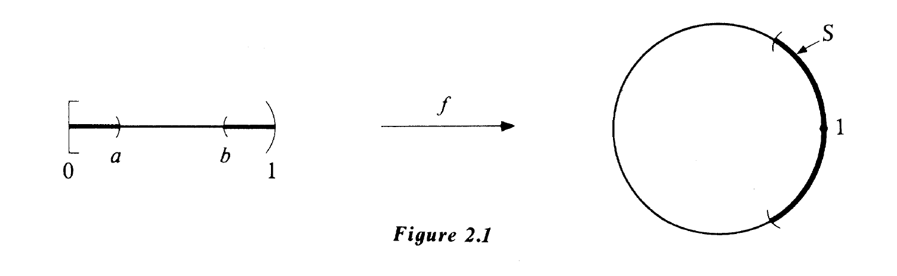
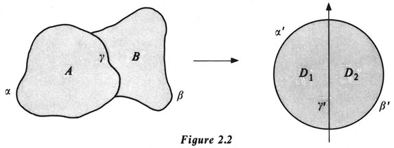
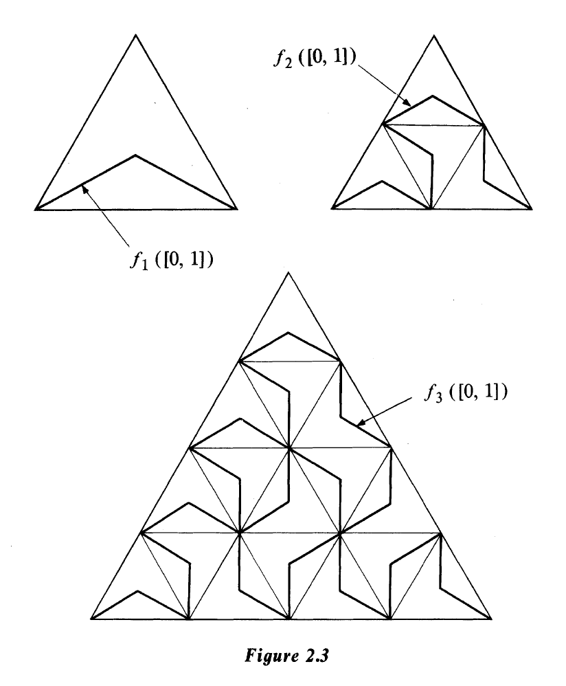
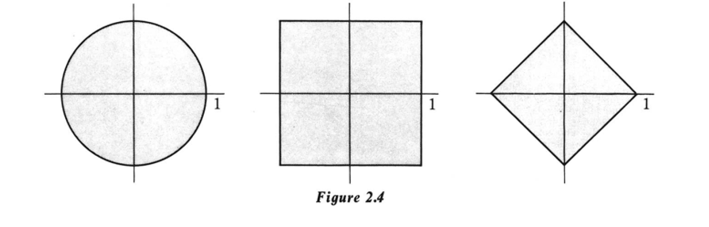

# Continuity

$$
&& \text{Geometry formerly was the chief borrower form arithmetic and algebra,}\\
&& \text{but it has since repaid its obligations with abundant usury; and if I were}\\
&& \text{asked to name, in one word, the pole star round which the mathematical}\\
&& \text{firmament revolves, the central idea which pervades the whole corpus of}\\
&& \text{mathematical doctrine, I should point to Continuity as contained in our }\\
&& \text{notions of space, and say, it is this, it is this!}\qquad \qquad \qquad \qquad \qquad \qquad\\
&& \qquad \qquad \qquad \qquad \qquad \qquad \qquad \qquad \qquad \qquad \qquad \qquad\qquad \qquad \qquad \qquad \qquad \qquad\Large{\text{J.J.S}_{\text{YLVESTER}}}
$$

## 开集和闭集

对于拓扑空间的定义在$\text{Chapter 1}$中已经给出,这很符合我们对于空间应该长什么样的直觉.不幸的是,它用起来并不方便,我们的首要任务是将其转化为一个等价的,更易于管理的公理集.

> 接下来的几步其实就是验证开集这一概念所引出的新邻域概念是否满足邻域的公理体系,是否可以使用开集这一概念来定义拓扑

令$X$为一个拓扑空间,且$X$的一个子集$O$若$O$对于其内的任意点都是邻域则称$O$是开$(\text{open})$的.根据定义$(\text{1.3})$的$3$得到对于两个开的子集$Q$和$P$,有$Q\cup P$包含$Q$与$P$,于是$\forall x \in Q\cup P\Rightarrow (x\in Q)\lor(x\in P)$.由于$x\in Q$和$x\in P$分别有$Q$为$x$的邻域和$P$为$x$的邻域,于是都有$Q\cup P$为$x$的邻域.于是得知$Q\cup P$对于其内任意点均为邻域,即$Q\cup P$在$X$中是开的.同理根据$2$得到它们的任意有限交都是开的. 不难发现整个拓扑空间$X$是开的,空集$\varnothing$也是开的.同样地,任给一个点$x$的邻域$N$,公理$4$告诉我们$N$的开核是$N$内包含$x$的一个开集.

在$\mathbb{E}^3$中若一个集合的每个点都能够被一个完全处于集合内的球所包围,则称这个集合是开的(翻译:$(O \subset \mathbb{E}^3)\land(O \text{ is open}) \Leftrightarrow\forall x\in O,\exist \delta(B(x,\delta) \subset O)$).举个例子,由不等式$z >0$所定义的半空间是开的,坐标满足$x^2 + y^2 + z^2 <1$的点集也是开的.另一方面,由$z \geq 0$所定义的集合不是开的,这是因为对于任意的在$(x,y)$平面上的球都与$z<0$有交集.对于无限个开集的集合不一定需要是开的,比如我们考虑
$$
\left\{(x,y,z) \left| x^2+y^2 + z^2<\frac{1}{2}\right.\right\}
$$
我们得到了$\mathbb{E}^3$的原点,其任意邻域都与$\mathbb{E}^3 \setminus\{(0,0,0)\}$有交点,于是它不是一个开集.

我们试着从反方向出发,从一个开集的概念出发,然后对于每一个点都建立一个邻域集合.假设我们现在有一个集合$X$以及$X$的一个非空开集合族(任意开集的并都是开的,任意有限多个开集的交也是开的,并且$X$和$\varnothing$也是开的).对于任意一点$x\in X$,子集$N \subset X$,若存在开集$O$使得$x\in O \subset N$则称子集$N$是$x$的邻域.

我们断言邻域这一新定义可以使得$X$成为一个拓扑空间.不难发现每一个点都至少有一个邻域,即$X$.并且其保证了定义$(1.3)$的$1$和$3$公理的成立.接下来需要验证的是公理$2$和公理$4$成立,先验证公理$2$.若$N_1$和$N_2$均为$x$的邻域,则存在$x\in O_1 \subset A_1$以及$x\in O_2 \subset A_2$其中$O_1$和$O_2$均为开集,不难发现$O_1 \cap O_2 \subset N_1 \cap N_2$由于$x\in O_1 \cap O_2 \subset N_1 \cap N_2$且$O_1 \cap O_2$为开集的有限交仍为开集,于是可以得到$N_1 \cap N_2$确实为$x$的邻域,即$2$在我们新的定义中是合法的.接下来验证$4$,不难发现$\mathring{N}$无非是$N$的最大开集,于是对于任意的开集$x\in O \subset N$都有$O \subset \mathring{N}$即$x\in O \subset \mathring{N}$即$\mathring{N}$确实为$x$的邻域.于是公理$4$在我们的新定义中是合法的.

> 这一步是证明邻域的开集定义确实符合邻域的公理体系,即开集确实可以定义出邻域(但是邻域不一定都是由开集所定义的,所以接下来我们需要验证所有的邻域都可以由开集定义)
>
> 欲得到上述断言,就需要验证先有邻域后由开集定义出的邻域与原来的邻域是一致的.
>
> 
>
> 而我们若想证明开集可以构造出拓扑空间,还需要证明一点,即开集构造的拓扑空间中的开集与原来开集的意义是一致的.在证明邻域概念一致的过程中发现必须先证明开集概念一致,才能进一步证明上一点

假设我们绕个圈子,我们从一组开集开始,用它们去构造一个拓扑空间$X$,然后观察$X$中的开集,这两个"开"(构成$X$的开集以及$X$中的开集)的概念是否一致呢?回答是肯定的.令$O$为一个原始的开集,那么根据定义,它是它在$X$中每一个点的邻域(自身就是一个开核,根据公理$4$立即得到),因此根据$X$中开集的定义可以得出$O$是$X$的开集.反过来,令$U$是$X$中的一个开集,对于$x\in U$,我们可以得到原始集合组中存在一个$O_x$使得$x\in O_x \subset U$.不难发现$U = \bigcup \{O_x: x\in U\}$(若不然,则$U$不符合拓扑空间中邻域的定义,而$U$显然是一个邻域(开集),即$U$必然可以由原始集合组经过交并变换得到),由于构成拓扑空间$X$的都是开集(指原始意义上),而开集的并均为开集,于是得知$U$在原始意义上也是开集.接下来我们让读者去检验另一种可能性,即我们从一个拓扑空间开始,引入开集的概念,然后用开集为每个点构造一组邻域,得到的邻域正是原始空间的邻域.

> 先验证原始空间的邻域是拓扑空间引入开集后构造的邻域.
>
> 对于拓扑空间$X$中的点$x$,若$N$为$x$的邻域,则$N$的开核$\mathring{N}$为$x$的邻域,且为一个开集,于是得到$x \in \mathring{N} \subset N$即$N$确实是由开集构造的邻域.
>
> 反过来,对于开集$O$中任意点$x$,我们可以在$X$中得到其一个邻域$N$,使得$N \subset O$(由定义可知$O$自身也是$x$的一个邻域,由于拓扑空间$X$的开集概念与原始的开集概念一致可以立刻得到该断言),那么由$O$构造出的邻域$N'$显然需要满足$x\in N \subset O \subset N'$,根据邻域的公理$3$可以得到$N'$确实为拓扑空间$X$的邻域.

上述讨论意味着,我们可以合理的使用开集来重新定义拓扑空间.

$(2.1)$定义. 集合$X$上的一个拓扑是一个$X$上的非空子集组(称为开集组$(\text{open sets})$,为与单个开集进行区分,用此名词),使得任意开集的并集均为开集,任意开集的有限交集均为开集,且$X$和空集$\varnothing$均为开集.一个具有上述性质的拓扑作用其上的集合称为拓扑空间.

这就是我们今后将采用的定义.

在$\mathbb{E}^n$上"寻常"的拓扑(也就是我们对于邻域的初始定义,球的那个)上的开集定义如下:给定集合$U$,若对于$x\in U$,我们永远可以得到一个正实数$\varepsilon$使得以$x$为球心,$\varepsilon$为半径的球$B(x,\varepsilon)$完全处于$U$内.今后每当我们提到$\mathbb{E}^n$时,都要记住这个拓扑结构.

若我们有了拓扑空间$X$以及$X$的子集$Y$,那么作用于$Y$的子空间或诱导$Y$上拓扑的开集组可以通过将$X$的开集组与$Y$求交集得到.换句话讲,对于$Y$的一个子集$U$,若我们可以找到$X$的一个开集$O$使得$U = O \cap Y$则认为$U$在$Y$的子空间拓扑上是开的.对于一个$\text{Euclidean}$空间的任意一个子集我们可以用这种方式从其周围的空间中获取拓扑.今后,当我们提到拓扑空间$X$的子空间$Y$时,我们的意思是$Y$为$X$的子集且具有一个子空间拓扑.

另一个极端的拓扑是$X$上的离散拓扑,在这种拓扑上,$X$的每一个子集都是开集,这是给定集合$X$上可能存在的最大的拓扑(若一个拓扑包含另一个拓扑的所有开集,我们说它比另一个"大")若$X$具有离散拓扑,我们称其为一个离散空间.例如,若我们取$\mathbb{E}^n$中具有整数坐标的点的集合,并给予其一个子空间拓扑,结果就是一个离散空间.

若拓扑空间一个子集的补集是开集,则称这个子集为闭的$(\text{closed})$.例如平面的一个单位圆(坐标满足$x^2+y^2\leq 1$的点所构成的集合),函数$y = e^x$的图像(不难发现在整个平面中这个图像的补集$U$是一个开集,其内任意点$\boldsymbol{x} = (x,y)$都存在一个$\varepsilon$使得$B(\boldsymbol{x},\varepsilon)\subset U$),或者满足$x \geq y^2$的点集(其补集为满足$x<y^2$的子集,显然是开的).这些集合均是闭的.

接下来仍然在$\mathbb{E}^2$上进行工作,考虑满足$x\geq 0$且$y >0$的点$(x,y)$所构成的集合$A$.这个集合$A$不是闭的,因为$x$轴在其补集上(其补集为$y \leq 0$或$x < 0$的所有点,自然包括了$x$轴)于是对于在$x$正半轴上的点为球心,任意$\varepsilon$为半径所构成的球均与$A$有交集,于是$A$不是闭的.同时可以注意到$A$也不是开的,取$y$轴的正半轴上的任一点$(0,y)$发现$(0,y)\in A$但是任意$\varepsilon$为半径所构成的球都与$A^c$有交点.于是存在既不开也不闭的集合.

同时,也存在着既开又闭的集合,比如整个拓扑空间$X$或$X$作为$\text{Euclidean}$空间$\mathbb{E}^2$中坐标满足$x \geq 1$或$x \leq -1$的所有$(x,y)$以$\text{Euclidean}$空间拓扑诱导的子拓扑所构成的子空间时,考虑坐标满足$x \geq 1$的所有点所构成的$X$的子集可以发现其在$X$上既开又闭(开集是显然的,其补集也是开集,所以其也是一个闭集.但是在$\mathbb{E}^2$上不是开的).我们发现任意一族闭集的交集还是闭集,任意有限个闭集的并集也是闭集(对于无限个的情况可以考虑满足$x>1$的所有闭集构成的并集,这显然是一个开集).也可以使用$\text{De Morgan}$律对于上述命题进行证明.

我们可以使用接下来讲述的方法来很好地刻画闭集.令$A$是一个拓扑空间$X$的子集且称$p$是$A$在$X$上的极限点$(\text{limit point})$或聚点若$p$的每一个邻域都包含$A \setminus\{p\}$的至少一个点.这样一个点可能在$A$中也可能不在$A$中

$Examples$

1. 取实线$\R$($\mathbb{E}^1$的常用名)为拓扑空间$X$,并且令$A$由点$\frac{1}{n},n = 1,2,\cdots$所组成.于是原点是$A$唯一的极限点.
2. 继续以$\R$作为拓扑空间,取$A = [0,1)$,则$A$中的任意点都是$A$的极限点,此外$1$也是$A$的极限点
3. 令$\mathbb{E}^3$为拓扑空间并且令$A$由所有坐标为有理数的点所组成则$\mathbb{E}^3$中的任一点都是$A$的极限点
4. 另一个极端,令$A$是由$\mathbb{E}^3$中所有坐标为整数的点所组成,则$A$没有任何极限点
5. 取$X$为所有实数的集合使用有限补拓扑$(\text{finite-complement topology})$作为其拓扑.在有限补拓扑中一个集合是开的若其补是有限的或就是$X$自身,若我们现在取$A$作为$X$的一个无限子集(比如全体整数的集合),则$X$中的每个点均为$A$的极限点(由于$x$的邻域必然包含一个开集,也就是说$x$的邻域必然包含一个在$X$中补集为有限集的集合,由于$A$为无限集,于是$X$中的任意点$p$的每一个邻域均包含$A\setminus\{p\}$的至少一个点,若不然,则邻域的补集不为有限集,即邻域不包含开集,于是任意点均为$A$的极限点),另一方面对于$X$中的有限子集则在这个拓扑中没有极限点.

$(2.2)$ 定理 : 一个集合是闭的当且仅当它包含它所有的极限点.

[证明] 

$(\Rightarrow)$若$A$是一个闭集,则$X \setminus A$是一个开集,由于开集对于其内部的任意点均为邻域,于是若$X\setminus A$包含$A$的极限点$p$,则$p$的每一个邻域都与$A\setminus \{p\}$有交,即$X\setminus A$与$A$有交集.于是$A$包含其所有的极限点.

$(\Leftarrow)$若$A$包含其所有的极限点,于是对于任意的$x \in X \setminus A$均有$x$不为$A$的极限点,也就是说$x$的每一个邻域均与$A \setminus \{x\}$无交,由于$x\in X\setminus A$,且$N(x) \cap A\setminus\{x\} = \varnothing$于是可以得知$X\setminus A$必然是$x$的一个邻域(包含$N(x)$),从而可以推导出$X \setminus A$是一个开集.$\Box$

集合$A$与其全部的极限点所组成的并集称为集合$A$的闭包,记作$\overline{A}$.

$(2.3)$ 定理 : 集合$A$的闭包是包含集合$A$的最小闭集,换句话说它是所有包含集合$A$的闭集的交.

[证明]

1. 先证明$\overline{A}$是一个闭集,假设存在一个集合$A$包含了其全部的极限点,则对于任意的$x\in X\setminus A$都有其不为$A$的极限点,那么总是存在$x$的一个邻域$N(x)$使得$N(x)\cap A \setminus\{x\} = \varnothing$即$N(x)\cap A = \varnothing$即$N(x)\subset X \setminus A$,于是根据邻域的公理$3$可知$X\setminus A$是$x$的邻域,即$X\setminus A$是一个开集,即$A$确实是一个闭集.
2. 对于任意闭集$B$,若其包含集合$A$则其包含集合$A$及其所有极限点,于是$B$包含$\overline{A}$.于是得到$\overline{A} = \bigcap B$.

$\Box$

$(2.4)$ 一个集合是闭集当且仅当这个集合就是其闭包.

若一个集合的闭包是整个空间,我们就说它在空间中是稠密的,这也就是例$3$的情况,稠密集相交于空间中每一个非空开子集.

集合$A$的开核(或称内部)$\mathring{A}$是集合$A$包含的所有开集的并集,当且仅当$A$是点$x\in A$的邻域时,我们可以容易地验证$x\in \mathring{A}$.一个开集自身就是一个开核,如果我们考虑$\mathbb{E}^2$且用$D$表示一个由满足$x^2+y^2 \leq 1$的点$(x,y)$所组成的单位圆盘,不难发现$D$的开核就是$D \setminus C$,其中$C$是一个单位的圆周.而$C$的开核是空的因为包含于$C$的唯一开集是空集.

另一个有用的概念是集合的边界.我们定义集合$A$的边界是集合$A$的闭包与集合$X\setminus A$的闭包的交集,即$\overline{A}\cap \overline{X\setminus A}$,一个等价的定义是$X$中不属于$A$的开核与$X\setminus A$的开核的所有点构成的集合.举个例子,在$\mathbb{E}^2$中,单位圆盘$D$,其开核$\mathring{D}$以及单位圆$C$都有着相同的边界$C$.由$\mathbb{E}^3$中所有坐标为有理数的点所组成的集合的边界就是$\mathbb{E}^3$,这表明边界可以是整个拓扑空间.

假设我们在集合$X$上有一个拓扑,且有一个开集组$\beta$使得每一个开集都可以由$\beta$中某些集合的并集表示.则称$\beta$为拓扑空间的基(即拓扑基),$\beta$的元素称为开集的基即(开集基).一个等价描述是给一点$x\in X$且$N$为$x$的邻域,则总是存在一个元素$B \in \beta$使得$x\in B \subset \beta$.一个很好的例子是实线上的拓扑,其中所有的开区间构成一个拓扑基,而所有具有有理端点的开区间构成一个更小的基(注意到第二个基是可数的)

通过指定拓扑的基来描述集合上的拓扑是很有用的,出于这个原因,我们希望能够决定一个给定的集合$X$的子集组何时是$X$上的某个拓扑的基.

$(2.5)$ 定理 : 令$\beta$是$X$的一个非空子集组.若$\beta$对于有限交封闭,且$\bigcup \beta = X$则$\beta$是$X$上某个拓扑的拓扑基.

[证明]

只需要证明$\beta$可以构成一个拓扑即可,我们把$\beta$的所有集合均视为开集,由于$\bigcup \beta = X$于是$X$是一个开集,于是$X$可以作为任意的$x\in X$的邻域,于是符合公理$1$和$3$.

由于$\beta$对于有限交集封闭,于是符合公理$2$.不难验证公理$4$成立.于是$\beta$可以构成一个拓扑空间,即$\beta$是$X$上某个拓扑的基.$\Box$

### $\text{Problems}$

1. 验证对于空间$X$的任意集合$A,B$,以下命题均成立

   $(\text{a}) \overline{A\cup B} = \overline{A}\cup \overline{B};(\text{b})\overline{A\cap B} \subset \overline{A}\cap \overline{B};(\text{c})\overline{\overline{A} } = \overline{A}$

   $(\text{d}) (A\cup B)\mathring{} \supset \mathring{A}\cup \mathring{B};(\text{e}) (A\cap B)\mathring{} = \mathring{A}\cap \mathring{B};(\text{f})(\mathring{A})\mathring{} = \mathring{A}$

   

   $(\text{a})$:$x\in \overline{A\cup B} \Leftrightarrow (x\in A)\lor(x\in B)\lor(x\text{是}A\cup B\text{的极限点})$,若$x$是$A\cup B$的极限点,则$x$的每一个邻域都与$A \cup B \setminus\{x\}$有交,即$x$的每一个邻域都与$A\setminus \{x\}$有交或与$B \setminus \{x\}$有交,于是得到$x$是$A\cup B$的极限点等价于$(x\text{是}A\text{的极限点})\lor(x\text{是}B\text{的极限点})$于是得知$x\in \overline{A\cup B}\Leftrightarrow (x\in A)\lor(x\text{是}A\text{的极限点})\lor (x\in B)\lor(x\text{是}B\text{的极限点})\Leftrightarrow (x\in \overline{A})\lor(x\in \overline{B})\Leftrightarrow x\in \overline{A}\cup \overline{B}$.

   

   $(\text{b})$:$x\in \overline{A\cap B}\Leftrightarrow ((x\in A)\land (x\in B))\lor(x\text{是}A\cap B\text{的极限点})$,若$x$是$A\cap B$的极限点,则$x$的每一个邻域都与$A\cap B\setminus\{x\}$有交,即$x$的每一个邻域都与$A\setminus\{x\}$有交且与$B \setminus\{x\}$有交,即$x$是$A\cap B$的极限点等价于$(x\text{是}A\text{的极限点})\land(x\text{是}B\text{的极限点})$于是得知$\overline{A\cap B} \subset \overline{A}\cap \overline{B}$.由于是$\land$不是$\lor$于是不能取等号

   

   $(\text{c})$:只需要证明$\overline{A}$的极限点就是$A$的极限点即可,若$\overline{A}$的极限点不为$A$的极限点,则至少存在一个点$x$使得$x$的某个邻域$N(x)$与$\overline{A}\setminus\{x\}$有交但是与$A \setminus\{x\}$无交,于是这个邻域$N(x)$只可能与$\overline{A}$相交于$A$所不包含的极限点上且$x$不是$A$的极限点.由于$\overline{A}$是一个闭集,于是得到$x$必然在$\overline{A}$内,即$x$必然为$A$的极限点,这与前文的推导矛盾,所以得知$\overline{A}$的极限点就是$A$的极限点.于是得到$\overline{\overline{A}} = \overline{A}$.

   

   $(\text{d})$:$x\in \mathring{A}\cup \mathring{B}\Leftrightarrow(x\in \mathring{A})\lor(x\in \mathring{B})$于是对于任意的$x\in \mathring{A}\cup \mathring{B}$在$A$或$B$中总是存在一个开集$O$使得$x\in O$,不难发现$O\subset A\cup B$于是得知$x\in (A\cup B)\mathring{}$.

   

   $(\text{e})$:$x\in \mathring{A}\cap \mathring{B}\Leftrightarrow(x\in \mathring{A})\land(x\in \mathring{B})$于是对于任意的$x\in \mathring{A}\cap \mathring{B}$在$A$和$B$中总是存在一个公共的开集$O$使得$x\in O \subset A\cap B$于是得知$x\in (A\cap B)\mathring{}$.由于$(A\cap B \subset A)\land(A\cap B \subset B)$于是可以得知$x\in \mathring{A}\cup \mathring{B}$即可以取等号(这也说明了为何$(\text{d})$不能取等号).

   

   $(\text{f})$:$x\in \mathring{A}\Leftrightarrow (x\in O \subset A)\land(O \text{ is open})$由于$\mathring{A}$是$A$中所有开集的并集,于是得知$x\in O\subset\mathring{A}$,由于开集的概念是一致的,于是$O$在$\mathring{A}$中同样是开集,即$O \subset (\mathring{A})\mathring{}$于是得知$x\in (\mathring{A})\mathring{}$至于反向是显然的.

   

2. 寻找实数上的一族闭集使得其并不是闭的

   前文已找到

   

3. 对于平面的一下子集,求其开核,闭包以及边界

   $(\text{a})\{(x,y):1<x^2+y^2\leq 2\}$;$(\text{b})$去掉两个轴的$\mathbb{E}^2$.

   $(\text{c})\mathbb{E}^2\setminus\{(x,\sin(\frac{1}{x})):x>0\}$

   

   $(\text{a})$:开核$\{(x,y):1<x^2+y^2<2\}$;闭包$\{(x,y):1\leq x^2+y^2\leq 2\}$;边界$\{(x,y): x^2+y^2 = 1 \lor x^2+y^2 = 2\}$

   

   $(\text{b})$:开核既是$(\text{b})$;闭包即$\mathbb{E}^2$;边界为两个轴

   

   $(\text{c})$:开核为$\mathbb{E}^2\setminus\{(x,\sin(\frac{1}{x})):x>0\}$;闭包为$\mathbb{E}^2$,边界为$\{(x,\sin(\frac{1}{x})):x>0\}$

   

4. 求实线上下列子集的所有极限点

   $(\text{a})\{(1/m)+(1/n):m,n =1,2,\cdots\};(\text{b})\{(1/n)\sin n:n = 1,2,\cdots\}$

   

   $(\text{a})$:$\{1/m:m = 1,2,\cdots\}$

   

   $(\text{b})$:$0$

   

5. 若$A$是$X$的一个稠密子集,并且$O$是$X$上的一个开集,证明$O \subset \overline{A\cap O}$.

   使用反证法即可,设$O$不是$\overline{A\cap O}$的子集,则存在$x\in O$但是$x\notin \overline{A\cap O}$即$x\in X\setminus \overline{A\cap O}$由于$\overline{A\cap O}$是一个闭集,于是$X \setminus \overline{A\cap O}$是一个开集,于是$X \setminus \overline{A\cap O}$是$x$的一个邻域,令$B = (X \setminus \overline{A\cap O})\cap O$得到$x\in B$.由于$X\setminus \overline{A\cap O}$和$O$均为开集,于是$B$也是开集,由于$A\cap B =\varnothing$,于是$x$不是$A$的极限点,由于$A$是稠密集,于是$X$中任意点均为$A$的极限点,于是得知$x$必须是$A$的极限点,与前文的结果矛盾.

   

6. 若$Y$是$X$的一个子空间,并且$Z$是$Y$的一个子空间,证明$Z$是$X$的一个子空间.

   $Y$的开集组是$X$的开集组与$Y$的交集,$Z$的开集组是$Y$的开集组与$Z$的交集,于是得知$Z$的开集组可以写为$X$的开集组与$Y$和$Z$的交集,由于$Z$是$Y$的一个子空间,于是可以得到$Z$是$Y$的一个子集,于是可以当得知$X$的开集组与$Y$和$Z$的交集相当于$X$的开集组与$Z$的交集.于是$Z$也是$X$的一个子空间.

   

7. 假设$Y$是$X$的一个子空间,证明一个$Y$中的闭集是$X$中的闭集与$Y$的交集.若$A$是$Y$的一个子集,证明$A$在$Y$中的闭包(在$Y$中取边界)即$A$在$X$中的闭包与$Y$的交集.

   先证明$X$的闭集与$Y$的交集是$Y$上的闭集,对于$X$中的闭集$A$,有$X\setminus A$是一个开集,于是$(X\setminus A) \cap Y = (X\cap Y) \setminus (A\cap Y) = Y \setminus (A\cap Y)$是$Y$上的一个开集,即$Y \setminus (Y\setminus(A\cap Y))$是一个闭集即$A\cap Y$是$Y$上的一个闭集.

   若$A$是$Y$上的闭集,则$Y \setminus A$是$Y$上的开集,于是存在$U \subset X$且$U$是开集使得$Y \setminus A = Y \cap U$.而$A = Y \setminus (Y\setminus A) = Y \setminus (Y \cap U) = Y \cap (Y \cap U)^c= Y \cap (X\setminus (Y \cap U)) = Y \cap (X\setminus U)$而$X\setminus U$是$X$上的一个闭集,.

   接着证明$A$在$Y$中的闭包是$A$在$X$中的闭包与$Y$的交集:

   设$A$在$X$中的闭包为$\overline{A}$,由前文可知$\overline{A}\cap Y$是$Y$上的一个闭集,且显然有$A \subset \overline{A}\cap Y$.由于$\overline{A}$是$X$中包含$A$的最小闭集,于是对于$Y$中所有包含$A$的闭集$B$都有$B \supset \overline{A}\cap Y$于是得到$\overline{A}\cap Y$是$Y$中包含$A$最小闭集,即其为$A$在$Y$上的闭包.

   

8. 令$Y$是$X$的一个子空间,给定$A \subset Y$,记$\mathring{A}_Y$是$A$在$Y$上的开核,$\mathring{A}_X$为$A$在$X$上的开核,证明$\mathring{A}_X \subset \mathring{A}_Y$并且举一个例子说明不能取等号.

   取$x\in \mathring{A}_x$存在$O_x\subset A$使得$x\in O_x \subset A \subset Y$于是得到$O_x\subset \mathring{A}_Y$即$x\in \mathring{A}_Y$即$\mathring{A}_X \subset \mathring{A}_Y$.

   取$X = \R,Y = \Z,A = \{0\}$则$\mathring{A}_X = \varnothing,\mathring{A}_Y = \{0\}$

   

9. 令$Y$是$X$的一个子空间,若$A$在$Y$上是开的(闭的),若$Y$在$X$上是开的(闭的),证明$A$在$X$上是开的(闭的).

   假设$A \subset Y \subset X$且$A$在$Y$上是开的,于是$A$可以作为$Y$的开集组的一员,于是存在$U\subset X$且$U$是开集使得$U \cap Y = A$,由于$Y$在$X$上是开的,于是得到$U \cap Y$在$X$上是开的,即$A$在$X$上是开的.

   同理得到闭集的情况.

   

10. 证明一个集合的边界总是包含其开核的边界,并且得到$A\cup B$的边界与$A$的边界和$B$的边界之间的关系.

    若$x\in \part \mathring{A}$则$x\in \overline{\mathring{A}}\cap \overline{X\setminus \mathring{A}} = \overline{\mathring{A}}\cap \overline{(X\setminus A)\cup (A\setminus \mathring{A})}$若我们可以得到$x\in \overline{\mathring{A}}$且$x\in \overline{X\setminus A}$我们就可以得到$x\in\part A$于是接下来我们假设$x\in \overline{\mathring{A}}$且$x\in \overline{A\setminus \mathring{A}}$由于$\overline{A} = \overline{\mathring{A}}\cup \overline{A \setminus \mathring{A}}$得到$x\in \part A$.

    后面那个懒得写了

    

11. 令$X$作为实线,且$\beta$作为一族由$\{x:a\leq x < b \text{其中}a<b\}$全体所构成的集族.证明$\beta$是$X$的一个拓扑基且$\beta$的每一个成员都是又开由闭的.证明这种拓扑没有可数基.

    先证明$\beta$可以作为$X$的一个拓扑基,显然有$\beta$对于有限交封闭,且$\bigcup \beta = \R = X$于是得到$\beta$可以作为一个拓扑基.

    接下来证明$\beta$的每一个成员都是闭的.考虑$\{x:a_1\leq x < b_1 ,a_1<b_1\}\in\beta$得到$X \setminus \{x:a_1\leq x < b_1 ,a_1<b_1\} = \{x: (x<a_1)\lor(x\geq b_1)\}$,可以分解为$\{x:x<a_1\}\cup \{x:x\geq b_1\}$左右部分均可以由$\beta$的成员组成,由于$\beta$是$X$的开集组,于是得到$\{x:x<a_1\}\cup \{x: x\geq b_1\}$是开集,即$\{x: a_1\leq x<b_1\}$是闭集.于是$\beta$的每一个成员都是又开又闭的.

    接下来证明这种拓扑没有可数基,我们只需要证明存在一族可数基$\alpha$即可.那么由于$\alpha$可数,于是对于$\alpha$中的每一个元素都可以进行标号,于是对于$\alpha$中的元素$A_n$可以构建为如下数列$\{A_n\}$.由于$\beta$是该拓扑空间的一个拓扑基,于是对于任意的$n$均存在一个区间$[a,b)$使得$A_n \subset [a,b)$于是我们将$[a,b)$内所有的元素都记为$n$(要求任意两个$A_i$与$A_j$之间是不相交的).那么我们应该能够得到一个函数$f : \R \to \N$.由于$\R$与$\N$不等势,于是这个函数不可能是一一的,即$\{A_n\}$无法表出$\R$即$\alpha$不可数.

    

12. 证明若$X$的拓扑有一个可数基,则$X$包含一个可数稠密子集,具有可数基的拓扑空间称为一个第二可数空间.包含一个可数稠密子集的空间称为可分空间.

    令$\{A_n\}$为$X$的一个可数基,于是$\bigcup_n A_n = X$.那么我们可以根据选择公理在每一个$A_n$中选出一个$a_n$使得$A = \{a_n\}$是一个可数子集,接下来证明$A$是稠密的,由于对于任意一个开集$O \subset X$,都有$O = \bigcup_j A_j$其中$A_j \in \alpha$.于是对于$x\in X$的任意邻域$N$都存在一个开集$O$使得$O \subset N$,而$O$由$A_j$所构成,于是$N \cap A_j \neq \varnothing$即$N\cap A \neq \varnothing$.即$\forall x \in X$都有$x$是$A$的极限点.

## 连续函数

连续性的概念特别容易使用开集来进行表述.接下来设$X$和$Y$是拓扑空间.

$(2.6)$ 定理 : 一个从$X$到$Y$的函数是连续的当且仅当$Y$中每一个开集的逆像都是$X$中的开集.

[证明]

$(\Rightarrow)$回忆在$\text{Chapter 1}$中给出的连续性的定义.一个函数$f : X\to Y$是连续的若对于$X$中的任一点$x$以及其像$f(x) \in Y$的邻域$N$都有集合$f^{-1}(N)$是$x$的邻域,则$f$是连续的.现在,令$f$是连续的,且$O$是$Y$的一个开集,于是$O$对于其内任意一点均为邻域,那么得到$f^{-1}(O)$对于其内任意一点也是邻域.于是$f^{-1}(O)$是$X$中的开集.

$(\Leftarrow)$若$O$是$Y$中的开集,且$f^{-1}(O)$是$X$中的开集,于是对于$O \subset N$有$f^{-1}(O)\subset f^{-1}(N)$,于是对于$f^{-1}(O)$内任意一点由于$f^{-1}(O)$是开集,于是有$f^{-1}(N)$为其邻域.$\Box$

连续函数在拓扑中通常简称为映射.

$(2.7)$ 定理 : 两个映射的合成也是一个映射

[证明]

假设$f:X \to Y$,$g:Y \to Z$是连续的;令$O$是$Z$上的一个开集,则$g^{-1}(O)$是$Y$上的一个开集,则$f^{-1}(g^{-1}(O))$是$X$上的一个开集,于是得到$(g\circ f)$是连续的.

$(2.8)$ 定理 : 假设$f:X \to Y$是连续的,并且令$A \subset X$有一个子空间拓扑.则$f\mid A:A \to Y$是连续的.

[证明]

令$O$作为$Y$上的一个开集,由于$f$是连续的,于是$f^{-1}(O)$是$X$上的一个开集,于是得知$f^{-1}(O)\cap A$是$A$上的开集,由于$(f\mid A)^{-1}(O) = A \cap f^{-1}(O)$于是$f\mid A$是连续的.

一个将$X$上每个点$x$映射到其自身的映射称为$X$的一个恒等映射,记作$1_X$,若我们将$1_X$限制在$X$的子空间$A$上就得到了一个包含映射(或称为嵌入映射)$i : A \to X$.

$(2.9)$ 定理 : 以下命题是等价的.

$(\text{a})$$f: X\to Y$是一个映射

$(\text{b})$若$\beta$是$Y$的一个拓扑基,则$\beta$中每个成员的逆像都是$X$中的开集.

$(\text{c})$$f(\overline{A})\subset \overline{f(A)}$对于$X$的任意子集$A$成立

$(\text{d})$$\overline{f^{-1}(B)}\subset f^{-1}(\overline{B})$对于任意$Y$的子集$B$成立

$(\text{e})$$Y$中任意闭集的原像是$X$中的闭集

[证明]

$(\text{a})\Rightarrow (\text{b})$,由于$f:X \to Y$是一个映射,于是由于$\beta$是$Y$的一个拓扑基,则$B \in \beta$是$Y$中的开集,于是得知$f^{-1}(B)$是$X$中的开集.

$(\text{b}) \Rightarrow (\text{c})$,令$A$作为$X$的子集,不难发现$f(A)$中的任意点均处于$\overline{f(A)}$内.欲证$f(\overline{A})\subset \overline{f(A)}$即证对于任意的$x\in \overline{A}\setminus A$有$f(x)\in \overline{f(A)}$.这无非就是说明对于$x\in \overline{A}\setminus A$都有$f(x)$是$f(A)$的极限点,接下来证明$f(x)$确实是$f(A)$的极限点,若$f(x)$是$f(A)$的极限点,则$f(x)$每个邻域都与$f(A)\setminus f(x)$有交,由于$\beta$是拓扑基,于是$\beta$中必然存在某个开集$O$使其包含$f(x)$,于是存在某个邻域$N$使得$f(x)\in O \subset N$,根据$(\text{b})$得到$f^{-1}(O)$是$X$上的开集,且包含$x$,于是得到$x\in f^{-1}(O)\subset f^{-1}(N)$,于是得知$f^{-1}(N)$也是$x$的邻域,由于$x$是$A$的极限点,于是$f^{-1}(N)\cap A \neq \varnothing$,于是取$m \in f^{-1}(N)\cap A$得到$(f(m)\in N)\land(f(m)\in f(A))$得知$N \cap f(A)\setminus f(x)\neq \varnothing$.得知$f(x)$确实是$f(A)$的极限点,则有$f(x)\in \overline{f(A)}$.

$(\text{c})\Rightarrow (\text{d})$,欲证$\overline{f^{-1}(B)}\subset f^{-1}(\overline{B})$即证$f(\overline{f^{-1}(B)})\subset \overline{B}$,由$(\text{c})$得知$f(\overline{f^{-1}(B)})\subset \overline{f(\overline{f^{-1}(B)})}$,于是我们只需要证明$\overline{f(\overline{f^{-1}(B)})}\subset \overline{B}$即可,对于任意的$x\in \overline{f(\overline{f^{-1}(B)})}$都有$x\in f(\overline{f^{-1}(B)})$或$x\notin f(\overline{f^{-1}(B)})$但是$x$为其极限点.若$x\in \overline{f(\overline{f^{-1}(B)})}$有$f^{-1}(x)\in \overline{f^{-1}(B)}$于是得知$f^{-1}(x)\in f^{-1}(B)$或$f^{-1}(x)$为$f^{-1}(B)$的极限点,前者直接说明$x\in B$,后者说明$f^{-1}(x)$的任意邻域均与$f^{-1}(B)\setminus f^{-1}(x)$相交,于是得知$x$的任意邻域都与$B \setminus x$相交,即$x$是$B$的极限点.接下来考虑$x$是$f(\overline{f^{-1}(B)})$的极限点的情况,得到$x$的每个邻域$N$均与$f(\overline{f^{-1}(B)})\setminus x$有交点,于是$f^{-1}(N)$与$\overline{f^{-1}(B)}\setminus f^{-1}(x)$相交,且$f^{-1}(N)$是$f^{-1}(x)$的邻域,由于$\overline{f^{-1}(B)}$是一个闭集,于是必然有$x\in \overline{f^{-1}(B)}$,于是得知$\overline{f(\overline{f^{-1}(B)})}\subset \overline{B}$

$(\text{d})\Rightarrow (\text{e})$,考虑$Y$中的闭集$B$,得到$B = \overline{B}$于是可以得到$f^{-1}(B)\subset \overline{f^{-1}(B)}\subset f^{-1}(\overline{B}) = f^{-1}(B)$这就得到$\overline{f^{-1}(B)} = f^{-1}(B)$,即$(\text{e})$得证.

$(\text{e})\Rightarrow (\text{a})$,考虑$Y$中的闭集$B$得到$B^c$是一个开集,由于$f^{-1}(B)$也是一个闭集,于是$f^{-1}(B)^c$是一个开集,由于$y\in Y \Leftrightarrow (y\in B) \lor(y\in B^c)$于是得知$f^{-1}(B^c) = f^{-1}(B)^c$得到$f^{-1}(B^c)$也是一个开集,即$Y$中开集的原像是一个开集,即$f$是一个映射.$\Box$

$Example$: 用$C$表示复平面上的一个单位圆,由$\text{Euclidean}$空间拓扑给予其子空间拓扑,然后从实线$\R$中给与区间$[0,1)$一个子空间拓扑,通过$f(x) = e^{2\pi i x}$定义函数$f:[0,1) \to C$,不难发现函数$f$是连续的(在$\text{Chapter 1}$中的$exercise$已经证明过),我们可以将$C$中所有开的段作为$C$的一个拓扑基.现在假设$S$是$C$的一个开的段,并且假设$S$不包含复数$1$,于是$f^{-1}(S)$就仅仅是一个形如$(a,b)$的开区间,其中$0<a<b<1$.于是可以得知$f^{-1}(S)$在$[0,1)$中是开的(由定理$(2.9)$且$S$作为$C$的拓扑基中的一员可以保证该命题成立).若$S$包含了复数$1$(如$\text{Figure 2.1}$所示),则$f^{-1}(S)$形如$[0,a)\cup (b,1)$其中$0<a<b<1$.由于它是$(-1,a)\cup(b,1)$与$[0,1)$的交而$(-1,a)\cup(b,1)$显然属于实线$\R$的某个开集组,于是得知$[0,a)\cup(b,1)$在区间$[0,1)$上是开的.定理$(2.9)$的$(\text{b})$基于$f$是连续的情况下.我们的函数显然是一个双射(一对一且$\text{onto}$即确实是一个映射),然而,它的逆并不是连续的,为了证明这一点我们需要构建一个$[0,1)$之间的开集$O$,使得$(f^{-1})^{-1}(O) = f(O)$在$C$上不是开的,令$O$为区间$[0,\frac{1}{2})$,但是它的像转化为角度后(人话:根据$\text{Euler}$公式将$e^{2\pi ix}$转化为$\cos 2\pi x+ i\sin \pi x$得到$f(O)$所对应的角度为$[0,\pi)$在拓扑空间$C$中不是开的.

一个同胚$h:X \to Y$是一个连续的,双射且具有连续逆的函数.从定理$(2.6)$中我们可以看出一个集合$O$在$X$中是开的当且仅当$h(O)$在$Y$中也是开的(此处用的是连续逆).因此$h$诱导了一个在拓扑空间$X$和$Y$之间的一一对应(此处应当为同构的意思,即保持了结构的一一对应)这就证明我们的断言得到$X$和$Y$是相同的拓扑空间.

$Example$ 令$S^n$表示在$\mathbb{E}^{n+1}$中离原点距离为$1$的所有点组成的球,赋予其一个子空间拓扑.我们断言从$S^n$中去掉某一个点就可以与$\mathbb{E}^n$同胚(个人感觉可以从$\text{Chapter 1}$的$exercise\,\,12$"立体投影"处就可以得到$S^3\setminus\{\text{North pole}\}$与$\mathbb{E}^2$同胚),我们定义一个映射$h : S^n \setminus \{p\} \to E^n$(称为立体投影),若$x \in S^n \setminus\{p\}$,则$h(x)$是$\mathbb{E}^n$与一条由$x$和$p$所决定的直线的交点.

不难证明$h$是双射.若$O$是$\mathbb{E}^n$上的一个开集,则可以得到一个$\mathbb{E}^{n+1}$中的一个新集合$U$使其点均位于从$p$开始经过$O$中点的直线上,除了点$p$外.这样就可以发现$U$在$\mathbb{E}^{n+1}$上也是开的.但是$h^{-1}(O)$是$U$与$S^n \setminus \{p\}$的交,因此$h^{-1}(O)$在$S^n \setminus \{p\}$上是开的,于是$h$是连续的,我们类似地处理$h^{-1}$,得到$h$确实是一个同胚.

我们给出几个在曲面一章使用的比较广泛的结果作为本节的结尾.接下来的圆盘是指与$\mathbb{E}^2$中一个封闭的标准圆盘同胚的任意空间.和前文一样,$C$代表单位圆.若$A$是一个圆盘,且$h:A \to D$是一个同胚,那么$h^{-1}(C)$称为$A$的边界,记作$\part A$.很明显,这个边界的定义与同胚$h$的选择无关.我们将在定理$(5.24)$中通过验证任意$D$到自身的同胚必然将$C$映射到$C$来证明这一点.

$(2.10)$ 引理 : 从圆盘边界到其自身的任意同胚均可扩张位整个圆盘的同胚.

[证明] 

令$A$作为一个圆盘,并且选择一个同胚$h : A\to D$.接下来给定一个同胚$g:\part A \to \part A$,那么不难发现$hgh^{-1}:C \to C$,且$hgh^{-1}$是一个同胚.接下来我们只需要证明$hgh^{-1}$可以拓展为$D$到$D$上的同胚,就可以将$g$扩张为$A$到$A$上的同胚:对于$hgh^{-1}$将$0$映射为$0$,并且对于$x\in D\setminus \{0\}$将$x$映射到$\|x\|hgh^{-1}(x/\|x\|)$.换句话说,呈圆锥型扩展.若我们将这个扩张称为$f$,则$hgh^{-1}$将$g$扩张为一个对于所有符合要求的$A$均成立的同胚.$\Box$

$(2.11)$ 引理 : 令$A$与$B$为以某个弧形为边界相交的圆盘.则$A\cup B$是一个圆盘.

[证明]

​	 

以$\gamma$表示弧线$A\cap B$,并且以$\alpha$,$\beta$表示$A,B$边界的补.我们构建一个从$A\cup B$到$D$的同胚,借助引理$(2.10)$,不难发现平面的$y$轴以很好的方式划分圆盘$D$为两个圆盘$D_1$和$D_2$的并.我们将组成$D_1$和$D_2$的三条弧线标记为$\alpha'$,$\beta'$以及$\gamma'$,不难发现无论是$\alpha$还是$\alpha'$均同胚于单位闭区间$[0,1]$,于是我们可以找到一个$\alpha$到$\alpha'$的同胚,我们先将其拓展到$\gamma$上,得到了一个$\alpha \cup \gamma$到$\alpha'\cup \gamma'$的同胚;于是我们可以得到一个$A$到$D_1$的同胚,将$\gamma$映射到$\gamma'$.然后,我们将这个同胚拓展到$\beta$上,得到一个$B$到$D_2$的同胚,最终考虑$\alpha \cup \beta$与$\alpha'\cup \beta'$的同胚,则有$A \cup B$与$D_1 \cup D_2 = D$同胚.$\Box$

### $\text{Problems}$

13. 若$f: \R \to \R$是一个映射(连续函数),证明在$f$中的不动点所构成的集合是$\R$的一个闭集,若$g$是$X$上的连续实值函数,证明集合$\{x:g(x) = 0\}$是闭集.

    记$f$的所有不动点组成的集合为$H$,对于任意的$x\in \overline{H}$得知存在一个序列$\{x_n\}\subset H$使得$x_n \to x(n \to \infty)$由于$f$在$\R$上是连续的,于是根据连续函数的性质有$x = \lim_{n \to \infty}x_n = \lim_{n \to \infty}f(x_n) = f(\lim_{n \to \infty}x_n) = f(x)$于是有$x\in H$于是有$H$是一个闭集.

    对于第二问证明$\{x:g(x) = 0\}$是闭集,即证$X \setminus \{x: g(x) = 0\}$是一个开集,对于任意的$y \in X \setminus \{x:g(x) = 0\}$都有$g(y)\neq 0$,那么对于一个包含了$g(y)$的开集$O$,由于$g$是一个$X$上的连续实值函数,于是根据$\R$的拓扑可以得知存在一个开集$O$使得$(g(y)\in O)\land (0 \notin O)$,那么不难得知$g^{-1}(O)$也是一个包含$y$的开集且$X \supset g^{-1}(O)\cap \{x:g(x) = 0\} = \varnothing$即$g^{-1}(O)\subset X \setminus \{x:g(x) = 0\}$.

    

14. 证明函数$h(x) = e^x/(1+e^x)$是一个从实线$\R$到区间$(0,1)$的同胚.

    首先证明$e^x /(1+e^x)$是一个映射.

    对于任意的$x\in \R$都有$h(x) = e^x/(1+e^x) = 1/(1+e^{-x})\in (0,1)$与之对应,所以$h(x)$确实是一个映射.

    接下来证明$h(x)$是双射

    1. 对于$h(x_1) = h(x_2)$,有$1+e^{-x_1} = 1+e^{-x_2}\Rightarrow x_1 = x_2$.于是$h$是一个单射
    2. 对于任意的$y \in (0,1)$不难发现$1/y \in (1,+\infty)$不难发现$1+e^{-x}$的值域也为$(1,+\infty)$于是必然存在一个$x$使得$y = h(x)$于是$h(x)$是一个满射.

    $1/y = 1+e^{-x} \Rightarrow (1-y)/y = e^{-x} \Rightarrow x = -\ln((1-y)/y) = \ln(y/(1-y))=\ln y - \ln(1-y) = h^{-1}(y)$,不难发现$h^{-1}(y)$是单调递增的.

    接下来证明$h(x)$连续,对于$(0,1)$区间中的任意开集$(a,b)$都有其逆像$h^{-1}(a,b) = (\ln a - \ln(1-a),\ln b - \ln(1-b))$是$\R$上的开集,于是得知$h(x)$确实是连续的.

    同理得到$h^{-1}$也是连续的,于是$h(x)$确实是一个同胚.

    

15. 令$f : \mathbb{E}^1 \to \mathbb{E}^1$是一个映射并且通过$\Gamma_f(x) = (x,f(x))$定义其图$\Gamma_f : \mathbb{E}^1 \to \mathbb{E}^2$.证明$\Gamma_f$是连续的并且其像(用$\mathbb{E}^2$诱导拓扑)同胚于$\mathbb{E}^1$

    对于任意一点$x \in \mathbb{E}^1$都存在一组数列$\{x_n\}\subset \mathbb{E}^1$使得$x_n \to x( n \to\infty)$,那么由于$f$是一个映射,则有
    $$
    \Gamma_f(x_n) = (x_n,f(x_n))\to (x,f(x)) = \Gamma_f(x)
    $$
    于是根据$\text{Euclidean}$空间中函数的连续性得到$\Gamma_f$是连续的.

    接下来证明其像同胚于$\mathbb{E}^1$,我们只需要通过$(x,f(x)) \mapsto x$诱导一个映射即可,即$\Gamma_f^{-1}$.我们需要证明$\Gamma_f^{-1}$是连续的,由于包含$x$的任意开集$O$都有$O\subset\mathbb{E}^1$且$\Gamma_f(O)$是$\text{Im}\Gamma_f$上包含了$(x,f(x))$的开集(视为$O\times (-\infty,+\infty)$与$\text{Im}\Gamma_f$的交).

    于是得到$\text{Im} \Gamma_f$同胚于$\mathbb{E}^1$.

    

16. 若$X$上定义的每个实值函数均为连续的,那么$X$必须具有什么拓扑?

    由于$X$上定义的每个实值函数均为连续的,于是考虑$\R$上的开集$(-\frac{1}{2},\frac{1}{2})$,考虑映射
    $$
    f(x) = 
    \left\{
    \begin{array}{c}
    f(x) = 0 , x = y\\
    f(x) = 1 , x \neq y\\
    \end{array}
    \right.
    $$
    于是我们可以得到$f^{-1}(-\frac{1}{2},\frac{1}{2}) = \{y\}$由于$f$是$X$上的实值函数,且$f$是连续的,于是得到$\{y\}$是$X$的开集,于是对于$\forall x\in X$都有$\{x\}$是开集,于是得知$X$是一个离散拓扑.

    

17. 令$X$为一个全体实数的有限补拓扑,并且通过$f(x) = x$定义$f: \mathbb{E}^1 \to X$,证明$f$是连续的,但是不是一个同胚.

    先证明$f$是连续的,对于任意$X$中的开集$O$有$O^c$是有限的或者$O^c = X$,由于$O$的补集$O^c$只有有限个点,由于单点集$\{x\}$在$E^1$中是一个闭集,于是得知有限个单点集的并集(即$O^c$)在$E^1$也是一个闭集,于是得到$O$在$E^1$中是一个开集.

    得到$f$是连续的.接下来证明$f$不是一个同胚,为此,我们需要证明$E^1$中的开集不是$X$中的开集,任意取$E^1$中补集不为有限集的开集(例如$(0,1)$)即可.

    

18. 假设$X= A_1 \cup A_2 \cup \cdots$其中对于每个$n$都有$A_n \subset \mathring{A}_{n +1}$,若$f:X \to Y$是一个满足对于每个$n$都有$f\mid A_n : A_n \to Y$相对于$A_n$上的诱导拓扑是连续的函数,证明$f$本身是连续的.

    由于对于$x \in X$,存在某个$n$使得$x\in A_n\subset \mathring{A}_{n+1}$于是得到$X = \bigcup \mathring{A}_{n+1}$.接下来我们假设$U$是$Y$上的一个开集,由于$f\mid A_n$在$A_n$的诱导拓扑上是连续的.于是可以得到$f^{-1}(U)\cap \mathring{A_n}  = f\mid_{\mathring{A}_n}^{-1}(U)$,在$\mathring{A}_n$中是开的.

    由于$X$可以写作$\mathring{A_n}$的分划.于是我们可以得知$f^{-1}(U) = f^{-1}(U)\cap \bigcup \mathring{A}_n$由于$\mathring{A}_n$是开集,于是得到$f^{-1}(U)$也是开集,即$f$本身是连续的

    

19. 空间$X$的子集$A$的特征函数$\chi_A$是一个$X$上的实值函数对于$A$中的点均取值为$1$而对于不属于$A$的点取值为$0$,使用特征函数的形式表示出$A$的边界.

    $A$的边界$\part A = \overline{X\setminus A} \cap \overline{A}$.于是可以得到若$\part A \neq \varnothing$则$\exists (a \in \overline{X \setminus A})\land(a\in \overline{A})$.

    由于在$A$的边界$\part A$上的点有可能属于$A$也有可能不属于$A$,单凭$A$的特征函数的值无法表示出$A$的边界,于是我们试着通过特征函数是否连续的角度来表示出$A$的边界.

    假设$A$的特征函数$\chi_A$在$a\in \part A$上是连续的,则对于$a \in X$且$a\in \part A\cap A$上的开集$\chi_A (a) \in U = (0.5,1.5)\subset \R$,于是得到$\chi_A^{-1}(U)$是一个开集,由于$a \in \partial A$于是得到$a \in \overline{X\setminus A}$得知$\overline{X \setminus A}\cap U\neq \varnothing$于是得到$X\setminus A \cap U \neq \varnothing$(不然,考虑$X \setminus A$的极限点$x\in \overline{X \setminus A}\cap U$,得到$U$为$x$的一个邻域,由于$x$为极限点,于是$U$必然与$X \setminus A$有交)于是存在$x \in X \setminus A\cap U$于是得到$\chi_A(x) = 1$,但是根据特征函数的定义有$\chi_A(x) = 0$造成矛盾,于是得到若$a \in \part A \cap A$则特征函数$\chi_A$是不连续的.

    接下来考虑$a \in \part A \cap (X \setminus A)$,考虑$U = (-0.5,0.5)$得到$\overline{A}\cap U \neq \varnothing$于是得知$A \cap U \neq \varnothing$于是得到$\chi_A(a) = 0,a \in A \cap U$矛盾,于是对于$a \in \part A \cap(X\setminus A)$是不连续的.

    

    接下来假设$a \in A \setminus \part A$则有$\chi_A(a) = 1$,对于$1$在$\R$内的所有邻域$N$都有$a \in \chi_A^{-1}(N)$,且满足邻域的其他三条公理,于是$\chi_A^{-1}(N)$确实是$a$的邻域,于是$\chi_A$在$a \in A \setminus \part A$上连续.

    接下来假设$a \in (X \setminus A)\setminus \part A$则有$\chi_A(a) = 0$对于$0$在$\R$内的所有邻域$N$,都有$\chi_A^{-1}(N)$是$a$的邻域,于是得知$\chi_A$在$a \in (X \setminus A)\setminus \part A$上连续.

    

    综上所述,$A$的边界为$\chi_A$的所有不连续点.

    

20. 开映射($\text{open map}$)是一个将开集映射为开集的映射;一个闭映射($\text{closed map}$)是一个将闭集映射为闭集的映射.判断下述映射是开的还是闭的?(在本题中统一假设映射的名称为$f$)

    $(\text{a})$ 从实线$\R$到复平面单位圆的指数映射$x \mapsto e^{ix} = \cos x + i \sin x$,我们将其表述为$x \mapsto x$其中右边的$x$为$C$的角度.

    对于$\R$上的开集$(a,b)$有$(a,b)\mapsto (a,b)$即将开区间$(a,b)$转化为角度$(a,b)$不难发现这也是$C$上的开弧,于是我们可以得到当$b-a \geq 2\pi$时$(a,b)$的像覆盖整个单位圆$C$,而对于拓扑空间$C$有其自身是一个开集.

    于是$x \mapsto e^{ix}$是一个开映射.

    接下来验证$x \mapsto e^{ix}$是否是一个闭映射,接下来令$E_n = [2n\pi + 1/n,(2n+1)\pi - 1/n]$,且令$E = \bigcup_n E_n$,假设$x$是$E$的极限点,那么对于$x$的任意邻域$N$都有$N \cap E\neq\varnothing$,于是有$N$必然与某个$E_n$有交点,于是得知$x$是某个$E_n$的极限点,而$E_n$是闭集于是得到$x \in E$即$E$是一个闭集,但是$f(E)$是$C$的上半圆,是一段开弧,得知$f(E)$是一个开集,即该映射不是一个闭映射

    $(\text{b})$ 由$f(x,y) = (x,|y|)$给出的折叠映射$f:\mathbb{E}^2 \to \mathbb{E}^2$.

    考虑$\mathbb{E}^2$上的单位圆盘$D$,得到$f(D)$为与轴线相交的一个上半圆盘,对于轴线部分显然有$f(D)$不为其邻域,于是得到$f$不是开映射.

    接下来验证$f$是否是一个闭映射,对于任意闭区间$E \subset \mathbb{E}^2$,令$E$与所有坐标满足$y \geq 0$的点$(x,y)$所构成的集合$\mathbb{E}^2_+$的交集为$E'$,以及对于所有的$y\leq 0$的$(x,y)$所构成的集合$\mathbb{E}^2_{-}$的交集为$E''$,接下来令$E'''$为$E''$关于$x$轴的反射.接下来可以得到$f(E) = E'\cup E'''$,由于$E,\mathbb{E}^2_+$以及$\mathbb{E}^2_-$都是闭集,于是得到$f(E)$是一个闭集.于是$f$是一个闭映射.

    $(\text{c})$在$\C$上的$z \mapsto z^3$

    一种常见的思想是将$z$转化为$a+bi$的形式然后对于其取$3$次方,但是在此处,我们实际上可以利用$\text{Euler}$公式,由于$e^{ix} = \cos x + i\sin x$于是得到复平面上任意一点$z$其实可以写为$re^{i\theta}$的形式,那么我们便不难得到$z^3$可以写为$r^3e^{3i\theta}$,我们将其转化为极坐标的形式,即$f:(r,\theta) \mapsto (r^3,3\theta)$.

    接下来我们想办法表示复平面上的任意开区间,这使用$(r,\theta)$来表示是很麻烦的,但是我们可以考虑整个复平面上的拓扑基,我们只需要证明$f$将拓扑基中每个成员均映射为开集即可证明$f$是一个开映射.我们使用$A_{\theta_1,\theta_2,r_1,r_2}$来表示$\{(r,\theta):r_1<r<r_2,\theta_1<\theta<\theta_2\}$,它显然是一个开集,那么,不难发现$\beta = \{A_{\theta_1,\theta_2,r_1,r_2}:\theta_2-\theta_1<\pi , 0\leq r_1<r_2\}$是$\C$的一个拓扑基($\text{Euclidean}$空间拓扑的拓扑基),对于$\theta_2-\theta_1< 2/3\pi$根据我们先前对于$f$的推导得到$f(A_{\theta_1,\theta_2,r_1,r_2}) = A_{3\theta_1,3\theta_2,r_1^3,r_2^3}$是一个开集,而$\theta_2 - \theta_1 \geq 2/3\pi$时为一个圆环,也是开集,而对于任意的$A,B$有$f(A\cup B) = f(A)\cup f(B)$于是得到$f$确实是一个开映射.

    接下来验证$f$是否是一个闭映射,对于$\C$上的闭集$E$,有其补集是开集,而由于$f(\C) = f(E\cup E^c) = f(E)\cup f(E^c) = \C$于是得到$f(E)^c = f(E^c)$于是由于$f$是一个开映射,得到$f(E)^c$是一个开集,于是$f$是一个闭映射.

    

21. 证明$\mathbb{E}^n$上的一个单位球($\text{unit ball}$坐标满足$x_1^2+\cdots+x_n^2 \leq 1$的所有点的集合)以及单位立方体($\text{unit cube}$坐标满足$|x_i|\leq 1,1\leq i \leq n$的点所构成的集合)若它们均从$\mathbb{E}^n$中获得子空间拓扑,则它们是同胚的.

    先从二维的情况入手,不难发现二维情况下的单位球无非是一个圆盘,我们只需要构建一个二维情况下的单位圆盘与单位正方体之间的对应关系便可以一窥高维情况下的关系了,那么根据$(2.10)$不难得出我们可以通过圆盘边界间的同胚来诱导两个圆盘之间的同胚.

    不难构建一个由正方形边界到圆盘边界的映射$f:x \mapsto \frac{1}{\|x\|}x$,接下来证明它是一个同胚.

    首先它显然是一个映射,且是一个双射.

    其次对于圆上的任意开弧都有其逆为正方形上的开弧,于是$f$是连续的,同理得到$f$的逆也是连续的.

    于是$f$可以拓展为正方形到圆盘之间的一个同胚.

    那么接下来我们对于高维的情况,同样可以发现$g: \boldsymbol{x} \mapsto \frac{1}{\|\boldsymbol{x}\|}\boldsymbol{x}$是一个由单位立方体表面到单位球面的一个映射,不妨考虑一个映射$h$,其将$0$映射为$0$,将单位立方体内的任意点$\boldsymbol{x}$映射为$\frac{1}{\|\boldsymbol{y}\|}\boldsymbol{x}$其中$\boldsymbol{y}$是一条经过原点和$\boldsymbol{x}$与单位立方体表面的交点.

    不难验证$h$是一个同胚.

## 一种空间填充曲线($\text{space - filling curve}$)

在$19$世纪末$\text{Guiseppe Peano}$带来了一个惊喜,乍一看,这是一个自相矛盾的发现.他指出了一个连续函数的存在性,这个连续函数定义在实线的封闭区间上,它将这个区间映射到平面上的一个二维区域上,比如一个正方形或三角形上.这样的函数称为$\text{Peano}$曲线或空间填充曲线.一种说法是我们可以将这个区间的图像看作是一条曲线,它穿过了所讨论的二维区域的每一个点.

空间填充曲线的存在表明,在定义空间维度的时候需要非常小心.将$X$的维数作为制定$x$的每个点所需的连续参数的最小个数的定义是不好的.$\text{Peano}$的例子表明,在这个定义下,正方形的维数为$1$,我们将在$\text{Chapter 9}$中对于尺寸进行简要讨论.

对于$\text{Peano}$的构造有许多个版本.眼下提供一个以等边三角形作为像的简单版本.正如我们所猜测的,空间填充曲线见识一系列比其更简单的曲线的极限,这些曲线沿着序列填充越来越多的三角形.设$\Delta$为一个平面上的一个边长为$\frac{1}{2}$的等边三角形,并且按照以下步骤构建一列连续函数$f_n:[0,1] \to \Delta$:最开始的三个函数,$\text{Figure 2.3}$充分地描述了最开始的三个函数,而序列的其它成员是通过迭代得到的,在每个特定的阶段,$\Delta$被分为若干个全等的三角形(当然是等边三角形),曲线在三角形内部的部分看起来与$\text{Figure 2.3}$中最上面的图像一模一样,并通过一条穿过其重心(三条中线的交点)的折线将其两个顶点连接起来.在下一阶段,我们将这个三角形拆分为$4$个小全等三角形并且构建如$f_2$所示的更复杂的曲线.我们按照先前的思路不断进行分割,$f_n$将会填充越来越多的$\Delta$.

给定$\mathbb{E}^2$上的两点$x,y$,我们将使用$\|x-y\|$来表示它们之间的距离.假设$n \geq m$,则给定$t \in [0,1]$我们都可以寻找到一个包括$f_m(t)$和$f_n(t)$的三角形并且其边长为$1/2^m$因此$\|f_m(t)-f_n(t)\|\leq 1/2^m$对于每个$t \in [0,1]$均成立,这也就证明了函数列$\{f_n\}$是一致收敛的.令$f:[0,1] \to \Delta$表示极限函数,由于每个$f_n$都是连续的,于是$f$是连续的.

接下来我们验证$f$确实填满了整个$\Delta$,首先,对于任意$n$均有$\Delta$中任一点与$f_n$的距离小于$1/2^n$.假定我们给定了一个点$x$以及$\mathbb{E}^2$中关于$x$的邻域$U$.选择$N$为一个足够大的以$x$为圆心,$1/2^{N-1}$为半径的圆盘,且包含于$U$,并且选择一个$t_0\in[0,1]$使得$\|x - f_N(t_0)\|\leq 1/2^N$.因为对于每个$t \in [0,1]$均有$\|f_N(t)-f(t)\|\leq 1/2^N$,那么,由三角不等式得到$\|x - f(t)\| \leq \|x-f_N(t_0)\| + \|f_N(t_0) - f(t_0)\|\leq 1/2^{N-1}$.于是$f(t_0)$必然处于$U$内.上述论点表明$\Delta$中的任意点均为集合$f([0,1])$的极限点.但是,我们将会在下一章(定理$(3.4)$以及定理$(3.9)$)发现一个从$[0,1]$到$\mathbb{E}^2$的连续函数的像必然是$\mathbb{E}^2$的一个闭集,于是其包含全部的极限点.我们就可以得知$f$的像为整个$\Delta$.

### $\text{Problems}$

22. 寻找一个能填满$\mathbb{E}^2$中的单位正方形的$\text{Peano}$曲线.

    由于我们证明能填满$\Delta$的$\text{Peano}$曲线是通过证明$[0,1]$的像为$\mathbb{E}^2$的一个闭集来证明的.也就是说我们只需要证明存在某个连续函数$g$,使得$h = g \circ f:[0,1] \to \text{unit square}$中$\text{unit square}$(方便起见,以后记为$\Box$,并不代表证明结束的$\Box$)中所有的点均为$h([0,1])$的极限点,那么我们若证明$\Delta$和$\Box$是同胚的,即可证明$f([0,1])$在$\Delta$中的极限点就是$h([0,1])$在$\Box$中的极限点即可,不难想象到,我们只需要证明存在一个从$\Delta$到$\Box$的同胚$g$即可,由于$\Delta$与$\Box$均为圆盘,于是自然同胚,于是$g$是存在的.那么$g \circ f$就是我们所求的曲线.

    

23. 找到一个从$[0,1]$到$S^2$的连续满函数.

    接下来试着构建一个$f : [0,1] \to S^2$且试着证明$f$是一个连续满函数,$S^2$为$\mathbb{E}^3$上所有离原点距离为$1$的点所构成的集合.

    由于我们先前已经得到了一个$h : [0,1]\to \Box = [0,1]\times [0,1]$,且$h$为一个连续满函数,接下来我们只需要证明存在一个映射$g: [0,1]\times [0,1] \to S^2$且$g$为满连续函数即可.

    由于我们根据立体投影可以得到$\mathbb{E}^2$与$S^2 \setminus\{(0,0,1)\}$同胚,于是可以我们选择这个同胚记其为$\pi$,由于$R$与$(0,1)$同胚,于是有$\mathbb{E}^2$与$(0,1)\times (0,1)$同胚$\mu$,记$f = \pi \circ \mu : (0,1)\times(0,1) \to S^2\setminus\{(0,0,1)\}$显然为一个同胚,于是我们只需要令
    $$
    g(x) = 
    \left\{
    \begin{array}{c}
    f(x), &x \notin \part \Box\\
    (0,0,1) , &x\in \part \Box\\
    \end{array}
    \right.
    $$
    即可,对于$O \subset S^2$且$O$为开集,考虑$g^{-1}(O)$,若$(0,0,1)\in O$则$\part \Box \subset g^{-1}(O)$由于$O$是一个开集,于是存在$\|x - (0,0,1)\|<\varepsilon$有$x \in O$,于是我们可以得知$\lim_{x \to (0,0,1)}d(f^{-1}(x),\part \Box) = 0$即对于$y \in \part \Box$有$B(y,r)\cap [0,1]\times [0,1]\subset g^{-1}(O)$,而$f^{-1}(x)$显然会构成一个开集,于是对于任意的$x \in g^{-1}(O)$都有$g^{-1}(O)$为其邻域,即$g^{-1}(O)$为一个开集.

    若$g^{-1}(O)$不包含$(0,0,1)$则由于$f$是一个同胚,于是得到$g^{-1}(O)$为开集,即$g$为连续函数.

    而$g$为满函数是显然的,于是$g$为一个连续满函数.

    

    

24. 是否能够找到一个填满平面的填充曲线

    不能

    

25. 是否存在一个能够填充$\mathbb{E}^3$中的单位立方体的填充曲线.

    由于存在$[0,1]\to [0,1]\times [0,1]$的单位填充曲线,于是对于$[0,1]\times [0,1]$我们将右侧的$[0,1]$填充为$[0,1]\times [0,1]$即可.

    
    
26. 略

## $\text{Tietze}$扩张定理

令$X$为拓扑空间,并且令$A$为$X$的一个子空间.给定一个$A$上的实值连续函数,我们很自然地会问,我们是否能把这个连续函数扩张到$X$上.换句话讲,我们可以在$X$上找到一个实值连续函数使其限制在$A$上时为我们给定的函数?一般来说,答案是否定的.举个例子,令$X = [0,1]$,$A = (0,1)$并且定义$f:(0,1)\to \mathbb{E}^1$为
$$
f(x) = \log \frac{x}{1-x}
$$
$f$是一个由$(0,1)$映射到$\R$的同胚,但是由于任何一个定义在闭区间上的函数必然有界,$f$不能扩张到单位闭区间上.本节的目的是描述一种我们总是可以扩张连续函数的特殊情况.

$(2.12)$ 定义: 集合$X$上的一个度量或距离函数是一个定义在笛卡尔积$X \times X$上的实值函数$d$且对于所有的$x,y,z \in X$有

$(\text{a})$ $d(x,y)\geq 0$且在$x = y$时取等

$(\text{b})$$d(x,y) = d(y,x)$

$(\text{c})$$d(x,y) + d(y,z)\geq d(x,z)$

一个具有度量的集合叫做度量空间(也叫做距离空间)

度量空间的概念在分析中非常有用,读者也应当接触过这方面的例子.任意的$\text{Euclidean}$空间(两点之间的距离为常规意义下的距离)是一个度量空间,定义在$[0,1]$上的实值连续函数的集合也是一个度量空间,其上两个函数之间的距离定义为
$$
d(f,g) = \sup_{t \in [0,1]}|f(t)-g(t)|
$$
度量空间的任意子集都继承了整个空间的度量,所以$\mathbb{E}^3$中的曲面是一个度量空间.

一个集合上的度量按照以下步骤诱导一个集合上的拓扑:令$d$为$X$上的一个度量.给定$x\in X$,集合$B(x,\varepsilon) = \{y \in X : d(x,y) \leq \varepsilon\}$被称为以$x$为球心以$\varepsilon$为半径的球或$\varepsilon$-球.对于$X$的一个子集$O$,我们定义若给定$x \in O$都存在一个正实数$\varepsilon$使得$B(x,\varepsilon) \subset O$,则是$O$开的.其满足的拓扑公理是很容易验证的.

注意到一个集合上不同的度量可能会给出同一个拓扑.比如,我们可以使用以下三种不同的方式将$n$维$\text{Euclidean}$空间的点集转化为度量空间.记$x = (x_1,x_2,\cdots,x_n)$为$n$维$\text{Euclidean}$空间中普遍存在的点且定义:

$(\text{a})$ $d_1(x,y) = [(x_1 - y_1)^2 + \cdots + (x_n-y_n)^2]^{\frac{1}{2}}$

$(\text{b})$ $d_2(x,y) = \max_{1\leq i \leq n}|x_i - y_i|$

$(\text{c})$ $d_3(x,y) = |x_1 - y_1| + \cdots+ |x_n - y_n|$

$\text{Figure 2.4}$展示了在这三种距离之下$n = 2$时以原点为球心,$1$为半径的球.为证明$d_1$和$d_2$诱导了同一个拓扑,我们注意到在任意圆盘中我们都可以找到一个正方形,并且在正方形中我们又可以找到一个圆盘.于是它们定义了相同的开集.如果我们将前文的讨论使用度量$d_3$的正方形进行替换仍然可以得到同样的结果.因此这三个度量在$\mathbb{E}^n$中给出了相同的拓扑.

> 根据前文的讨论不难发现两个不同的距离诱导出相同的拓扑的充分必要条件是它们的开集之间可以相互包含.

给定度量空间中两个不同的点,我们总能找到包含它们的不相交开集.对于$d(x,y) = \delta >0$,集合$U = \{z \in X: d(x,z) <\delta/2\}$以及$V = \{z \in X : d(y,z)< \delta /2\}$则$U$和$V$均为开集(它们分别为$B(x,\delta/2)$和$B(y,\delta/2)$的开核),它们是不相交的,并且显然有$x \in U$且$y \in V$.集合$U$通常称为以$x$为球心,$\delta/2$为半径的开球.对于一个满足其内任意两互异的点都被两个不相交的开集所包含的(即满足我们前文所述性质)空间叫做$\text{Hausdorff}$空间.

不是每一个拓扑空间都是$\text{Hausdorff}$的,举个例子,实线上的有限补拓扑空间就不是$\text{Hausdorff}$的,其任意两个开集必然相交.

若$d$是$X$上的一个度量,且$A$是$X$的一个子集,距离$d(x,A)$被定义为$\min_{a \in A}d(x,a)$

$(2.13)$引理 : 由$x \mapsto d(x,A)$诱导出的$X$上的实值函数是连续的.

[证明]

令$x\in X$且$N$为$d(x,A)$在实线上的邻域.选定$\varepsilon >0$使其足够小以至于$(d(x,A)-\varepsilon , d(x,A)+\varepsilon)$在$N$内.令$U$表示以$x$为球心$\varepsilon/2$为半径的开球,取一点$a$使得
$$
d(x,a)<d(x,A)+\varepsilon/2
$$
由于$d(x,A) = \min_{a \in A}d(x,a)$知$a$必然存在.

于是对于$z \in U$,总是存在
$$
d(z,A)\leq d(z,a)\leq d(z,x)+d(x,a)\leq \varepsilon/2+d(x,A)+\varepsilon/2 = d(x,A)+\varepsilon
$$
于是得知$d(z,A)\in (d(x,A)-\varepsilon,d(x,A)+\varepsilon)$对于任意的$z \in U$成立,由于$U$是一个开集,于是得到$N$的逆像包含$U$于是$N$的逆像是$x$的一个邻域,于是我们就可以得到$x \mapsto d(x,A)$是一个连续函数.$\Box$

$(2.14)$ 引理 : 若$A,B$为度量空间$X$的不相交的闭集,则存在一个$X$上的连续实值函数将$A$上的点映射至$1$,将$B$上的点映射至$-1$,且将$X \setminus (A\cup B)$映射为严格处于$\pm 1$之间的值.

[证明]

由于$A$和$B$为不相交的闭集,于是可以得知$d(x,A)+d(x,B)$永远不可能是$0$,而且由于距离具有非负性$(\text{a})$,我们可以得知$d(x,A)-d(x,B)<d(x,A)+d(x,B)$由于我们将$B$映射到$-1$,$A$映射到$1$,于是我们先试着利用距离构造一个函数来表示它们(由于将点映射到距离的函数是一个连续实值函数,且若干个连续实值函数的四则运算以及复合依然是连续实值函数)

不难发现我们构造出来的函数$f(x)$形如$\frac{d(x,B)-d(x,A)}{d(x,B)+d(x,A)}$,这时$x\in B\Rightarrow f(x) = -1$且$x \in A \Rightarrow f(x) = 1$,且不难发现对于任意的$x \in X \setminus (A \cup B)$都有$f(x) \in (-1,1)$.$\Box$

$(2.15)$ $\text{Tietze}$扩张定理: 任意一个定义在度量空间的一个闭集上的连续实值函数都可以被扩张到整个空间上.

[证明]

令$X$为一个度量空间,$C$为一个闭集,且存在一个映射$f : C \to \mathbb{E}^1$.我们先假设$f$是有界的,即对于任意的$x \in C$都有$|f(x)|\leq M$

令$A_1$为$C$中$f(x)\geq M/3$的点所构成的集合,且$B_1$为$C$中$f(x)\leq -M/3$的点所构成的集合.不难发现$A_1$和$B_1$显然是不相交的,并且它们显然都是闭集,举个例子,$A_1$是$\mathbb{E}^1$中$[M/3,+\infty)$的逆像,于是根据$f$的连续性可以得知$A_1$是一个闭集.但是由于$C$在$X$中是一个闭集,于是$A_1$必然是$X$中的闭集.我们可以对于$B_1$进行类似讨论.于是我们就可以根据引理$(2.14)$得到一个函数$g_1:X \to  [-M/3,M/3]$将$A_1$中的点映射为$M/3$,$B_1$中点映射为$-M/3$,且将$X\setminus (A_1 \cup B_1)$的点映射到$(-M/3,M/3)$于是可以得知对于任意的$x \in C$都有$|f(x)-g_1(x)|\leq 2M/3$(注意此时上界已经缩小到了$2/3$倍的$M$).

接下来对于函数$f(x)-g_1(x)$进行考虑,令$M_1 = 2M/3$于是取$A_2$为$f(x)-g_1(x)\geq M_1/3$的点所构成的集合,$B_2$为$f(x)-g_1(x)\leq - M_1/3$的点所构成的集合.于是得知可以构建一个函数$g_2 :X \to [-M_1/3,M_1/3]$将$A_2$的点映射到$M_1/3$,将$B_2$的点映射到$-M_1/3$于是得到$|f(x)-g_1(x)-g_2(x)|\leq 2M_1/3 = 4M/9$.

以此类推最终可以得到$g_{n+1} : X \to [-M_n/3 , M_n /3]$即$X\to [-2^{n}M/3^{n},2^nM/3^n]$其满足

$(\text{a})$$|f(x)-(\sum_{i = 1}^{n+1}g_i(x))|\leq 2^{n+1}M/3^{n+1}$

$(\text{b})$对于$x\in X\setminus C$有$g_{n+1}(x)<2^{n}M/3^{n+1}$

那么由于$\sum_{i = 1}^{\infty}g_i(x)< \sum_{i = 1}^\infty 2^{i-1}M/3^i = M$且$|f(x)-(\sum_{i = 1}^{\infty}g_i(x))|<\varepsilon$($\varepsilon = (2^{n+1}+1)/3^{n+1}\to 0 , n \to \infty$)

于是我们得到$g(x) = \sum_{i = 1}^{\infty}g_i(x)$使得$|g(x)|$在$X \setminus C$上严格小于$M$.

接下来考虑$f$是一个无界函数的情况,我们只需要再额外构建一个同胚$h : \mathbb{E}^1 \to (-1,1)$即可得到$h \circ f$是一个有界函数,再进行讨论即可.$\Box$

### $\text{Problems}$

27. 证明当且仅当$x\in \overline{A}$时$d(x,A) = 0$.

    $d(x,A) = 0 \Leftrightarrow \min_{a \in A}d(x,a) = 0$即对于$x$的任意邻域$N$,由于对于任意的$\varepsilon$总是存在一个$a \in A$使得$d(x,a) = 0 < \varepsilon$于是得到$N \cap A  \neq\varnothing$,若$x \notin A$则$N\cap(A \setminus \{x\})\neq \varnothing$,即$x \in \overline{A}$.

    同样地,对于$x\in \overline{A}$要么有$x \in A$,这自然可以得到$d(x,A) = 0$,要么有$x$为$A$的极限点,即对于任意的开集$x \in O$都有$O \cap A\neq\varnothing$,于是对于任意的$\varepsilon >0$都有$B(x,\varepsilon)\cap A \neq \varnothing$即$d(x,A) = 0$

    

28. 若$A,B$为一个度量空间中两个不相交的闭集,那么存在度量空间中两个不相交的开集$U,V$使得$A \subset U$且$B \subset V$.

    由于$A,B$为度量空间中两个不相交的闭集,于是根据引理$(2.14)$可以得知存在一个连续实值函数将$A$映射为$-1$,$B$映射为$1$,将度量空间中其它点映射到$(-1,1)$,于是我们在$[-1,1]$中任取$-1<a<b<1$取$[-1,a)$和$(b,1]$的逆即可

    

29. 证明任意集合$X$上都可以通过$d(x,x) = 0$以及$x \neq y$时$d(x,y) = 1$来定义距离,并且说明这诱导了一个什么样的拓扑

    显然符合距离定义(容易验证,$d(x,x) = 0$,$d(x,y)>0$,$d(x,y) = d(y,x)$且$d(x,y)+d(y,z)\geq d(x,z)$)

    瞪眼法瞪出离散拓扑(由于$\{x\}$包含$B(x,\varepsilon)$其中$0<\varepsilon<1$于是$\{x\}$是开集)

    

30. 证明度量空间中每一个闭集都是可数个开集的交集.

    根据27可以得知$A$为闭集时$x \in A \Leftrightarrow d(x,A) = 0$于是构建$A_n = \{x\in X: d(x,A) < 1/n\}$即可

    显然有$A \subset \bigcap_n A_n$,然后对于任意的$x \notin A$由于$A$是闭集于是有$\min_{a \in \bigcap_n A_n} d(x,a)>0$.于是得到$x \notin \bigcap_n A_n$即$\bigcap_n A_n = A$

    

31. 若$A,B$为度量空间的子集,它们的距离$d(A,B)$为$\inf_{x \in X,y \in Y}d(x,y)$.找到两个互不相交且距离为$0$的闭集.$A$的直径为$\sup_{x,y \in A}d(x,y)$验证刚刚说到的那两个闭集的直径均为无限的.

    若存在两个互不相交且距离为$0$的闭集,这两个闭集应当如同$1/x$与$x$轴一般可以无限接近而无法达到,于是我们可以构建$\{(x,1/x): x \in \R\}$以及$x$轴作为$\mathbb{E}^2$这个度量空间上的两个闭集,不难验证上述性质.

    

32. 若$A$是度量空间$X$的一个闭集,证明任意映射$f : A \to \mathbb{E}^n$都可以扩展到$X$上

    由于映射均为连续函数,于是$f$必然是连续的.

    接下来我们对于$\mathbb{E}^n$的每一个维度进行分析,以第$m$维为例,构建投影$\pi_m : (x_1,x_2,\cdots,x_n)\mapsto x_m$,而后对于$f_m = \pi \circ f$进行分析.

    由于$f$是一个连续函数,接下来证明$\pi_m$也是一个连续函数,对于开集$(a,b)\in\mathbb{E}^1$其原像为$(\mathbb{E}^1,\mathbb{E}^1,\cdots,\mathbb{E}^1,(a,b),\mathbb{E}^1,\cdots,\mathbb{E}^1)$显然也是一个开集,于是得知$\pi_m$是连续的.

    于是得到$f_m$也是一个连续函数,使用$\text{Tiztez}$扩张定理可以直接证明在第$m$维上存在一个$g_m:X\to \mathbb{E}^1$使得对于$x\in A$有$g_m(x) = f_m(x)$.

    于是我们考虑函数$g(x) = (g_1(x),g_2(x),\cdots,g_n(x))$得到$\forall x \in A$有$g(x) = f(x)$即$g(x)$为$f(x)$扩展到$X$上的函数

    

33. 找到一个从$\mathbb{E}^1 \setminus\{0\}\to \mathbb{E}^1$但是不能拓展到$\mathbb{E}^1$的映射.

    考虑$f(x) = 1/x$即可

    

34. 令$f: C \to C$为平面上的单位圆的恒等映射,将$f$拓展为$\mathbb{E}^2 \setminus \{0\} \to C$,你希望如何将$f$拓展到$\mathbb{E}^2$上

    $g:x \mapsto x/\|x\|$ 

    

35. 给定一个映射$f: X \to \mathbb{E}^{n+1}\setminus \{0\}$找到一个映射$g: X \to S^n$在集合$f^{-1}(S^n)$上与$f$一致.

    我们只需要将$f$映射到$S^n$的部分让$g$也映射到$S^n$上即可.

    于是考虑$x \mapsto x/\|x\|$诱导的$h : \mathbb{E}^{n+1}\setminus \{0\}\to S^n$,其在$S^n$上为恒等映射,于是得到$g = h\circ f$将$x \in f^{-1}(S)$映射为$h(f(x)) = f(x)$且$g:X \to S^n$.

    

36. 令$X$为一个度量空间且$A$在$X$上是闭的,证明一个映射$f:A \to S^n$总是可以扩张到$A$的(某一个)一个邻域上,换句话说,对于$X$的一个对于$A$中每个点来说都是邻域的子集.

    首先,由于$f:A \to S^n$,于是可以将$S^n$视为$\mathbb{E}^{n+1}$的一个子空间,即$f: A \to E^{n+1}$于是根据32得到我们可以扩张为$g:X \to \mathbb{E}^{n+1}$且$g\mid_A = f$而$\{0\}$为$\mathbb{E}^{n+1}$上的闭集,于是得到$g^{-1}(0)$是$X$上的闭集,再根据28可以得到存在$X$的两个开集使得$A \subset U,g^{-1}(0)\subset V$且$U\cap V=\varnothing$

    再使用35中的$h : x \mapsto x/\|x\|$即可得到$k = (h \circ g )\mid_U: U \to S^n$为我们所需要的扩张

